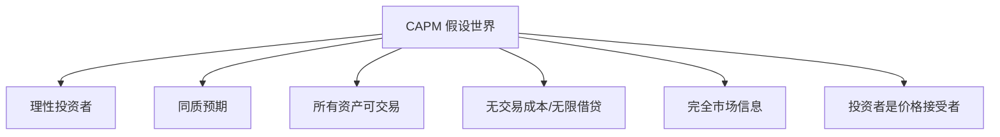
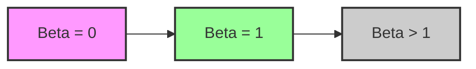
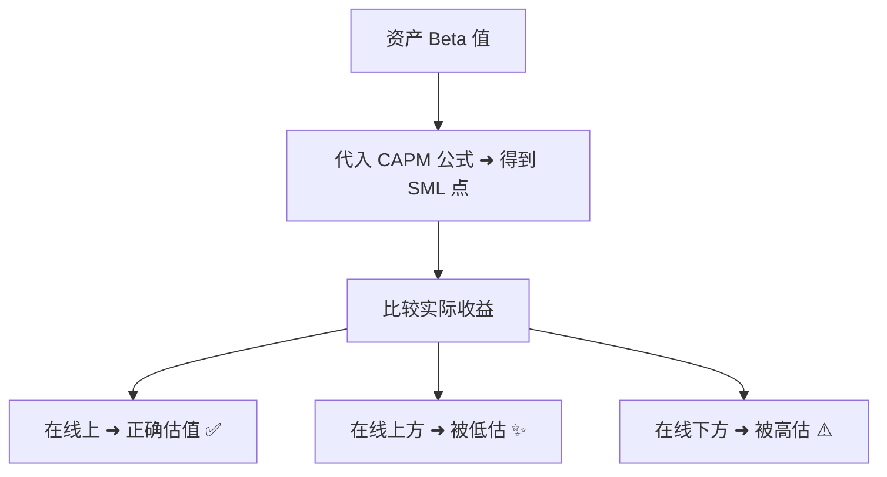
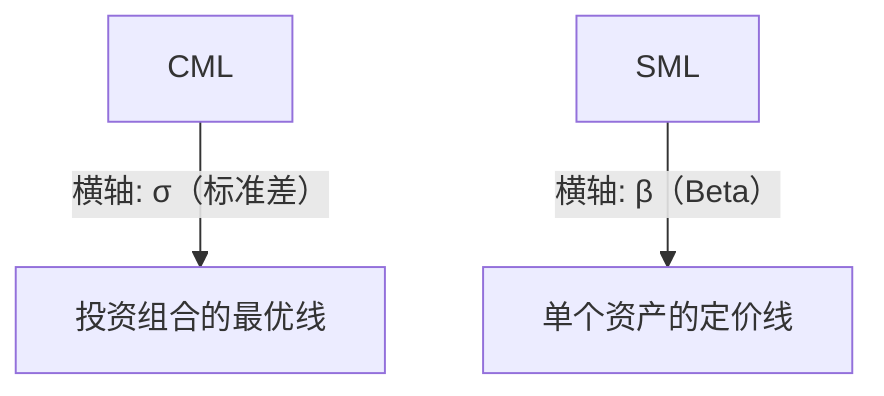

You: 

Task: 深入学习研究资本资产定价模型(CAPM)里面的技术细节 Methid: 耐心引导式&选择题提问式&知识卡片/QA闪卡总结式&interesting-examples/jokes-driven&一步一步拆解分析 Bonus&Candy🍬:colorful emoji & 幽默有趣 & 有思想深度 & 图解/闪卡 & funny games Notice: 我们可以quote原文中的核心句子&每隔几段进行总结复习 首先给出学习大纲

ChatGPT: 

太棒了 🍭！CAPM（资本资产定价模型）不仅是金融学中的一颗数学明珠 💎，还是投资理论里讲“风险与收益关系”的压舱石 🚢。我们会用轻松有趣但又富有思想深度的方式，一步一步拆解这个模型。

---

## 🧭 学习大纲：CAPM 深入剖析路线图

我们将把 CAPM 拆成以下 7 大模块，每个模块都有：  
🎯 知识卡片 🃏、趣味选择题 🎲、幽默段子 🤹‍♂️、图解讲解 🎨、总结复盘 ⏪。

---

### 📦 Part 1. CAPM 的宏观定位：为什么我们需要 CAPM？

-   投资决策三问（收益、风险、关系？）
    
-   从均值-方差理论 🚀 到 CAPM 的动机
    
-   市场组合 & 无风险资产：CAPM 背后的理想世界 🌍
    

---

### 🧠 Part 2. CAPM 模型假设解析（这是它的“性格设定”🧬）

-   投资者行为假设（风险厌恶、期望收益最优解）
    
-   市场结构假设（完全市场，无税无摩擦）
    
-   这些假设带来的“甜蜜陷阱”🍩
    

---

### 🧪 Part 3. CAPM 的数学建模过程 🧮

-   无套利 & 均衡推导的两种路线
    
-   系统性风险 vs 非系统性风险（β 的来源）
    
-   预热公式：
    
    $$
    E(R_i) = R_f + \beta_i (E(R_m) - R_f)
    $$
    

---

### 📐 Part 4. Beta 的直觉+几何意义 🧭

-   Beta 的定义与计算：协方差和方差的浪漫
    
-   图解：Beta 在收益-风险图上的斜率 🟢
    
-   Beta > 1 是“勇者”？Beta < 1 是“佛系”？😂
    

---

### 📊 Part 5. 安全性市场线（SML）全图解 🎨

-   SML 是什么？它长什么样？
    
-   怎么用 SML 判断资产是否定价正确？
    
-   超额收益的 SML 视角 🧯
    

---

### 🎯 Part 6. CAPM 的实用与争议 🔍

-   在现实市场中效果如何？（经验数据 vs 理论）
    
-   被谁挑战过？（比如Fama-French 三因子模型）
    
-   有哪些“非学术”的好玩比喻 🧸？
    

---

### 🧩 Part 7. 知识串联与面试题演练 💼

-   CAPM 速记口诀/思维导图
    
-   高频面试题 & 趣味游戏问答挑战 🧠🕹️
    

---

📝 **你可以自由选择从哪一部分开始学习！**  
建议我们从第1章“CAPM 的宏观定位”开启，先建立大局观 🔭。你准备好了吗？还是你想直接跳到某一部分深入？👇

1.  从头开始！一步不漏 🎬
    
2.  跳到模型公式（Part 3）直击重点 💥
    
3.  从 Beta 的几何直觉学起（Part 4）📐
    
4.  我有自己的疑问，想直接提问 💡
    

你来选~🍭

You: 

1

ChatGPT: 

完美选择！🎬我们从 **Part 1：CAPM 的宏观定位** 开始，让你先对整个模型的来龙去脉有个鸟瞰 🦅，像看侦探片一样揭开它的谜团。

---

## 🎯 Part 1：CAPM 的宏观定位 —— 为什么我们需要 CAPM？

---

### 🧩 1.1 投资三问：我们为什么要定价资产？

投资者每天都在做这些事：

> ❓ 我投这个资产，能赚多少？  
> ❓ 赚这些钱，我要冒多大风险？  
> ❓ 这么多风险，值吗？有没有更划算的选择？

这三问，正好构成了资产定价模型的核心目标：  
➡️**将“期望收益”与“风险”之间建立起一种数学关系。**

CAPM 就是这样一个英雄登场的模型 💥。

---

### 😮‍💨 小问题环节：

哪一个选项最能概括 CAPM 的核心动机？

A. 用来计算企业利润  
B. 预测货币政策走向  
C. 研究风险如何影响资产收益  
D. 研究市场参与者的交易心理

选哪个？👉 等你作答我再继续解释 🍬

You: 

c

ChatGPT: 

💯 完全正确！C 是正解！

> 🎉 **CAPM 的核心目的就是：研究风险（尤其是“系统性风险”）如何影响资产的期望收益。**

我们来做个简短回顾 🧠：

---

### 🃏【知识卡片：CAPM 的核心目标】

| 项目 | 内容 |
| --- | --- |
| 🔍 目标 | 建立资产期望收益与其风险（Beta）的线性关系 |
| 💡 灵感来源 | 投资组合理论（Markowitz）强调收益-风险权衡 |
| 📏 核心观点 | 投资者只因“承担系统性风险”而获得额外收益 |

---

现在我们继续前进，进入故事主线第二段👇

---

### 🛣️ 1.2 从“均值-方差理论”迈向 CAPM

CAPM 并不是凭空冒出来的，它是站在 **Harry Markowitz** 的“均值-方差”巨人肩膀上发展来的。

🥼 Markowitz 说：

> “一个理性的投资者不是追求最高收益，而是追求**在一定风险下的最优组合**。”

这意味着什么？我们可以用一个形象的比喻🎨：

---

### 🧀 比喻时间到 🍕

如果资产是食物，你是个吃货投资人 🍽️：

-   “收益” = 味道 ✅
    
-   “风险” = 发胖概率 ❌
    

你不是吃越多越好，而是追求 **“在不胖的前提下吃最香”**。  
👉 这就叫：**收益-风险平衡**

Markowitz 提出的投资组合理论，就是找一组“既香又不胖”的资产组合。而 CAPM 是基于这个框架，进一步问了一个“灵魂问题”：

> 如果市场已经最优配置了组合，那每个资产到底该值多少钱？（也就是它的期望收益应该是多少？）

🎯 CAPM 就是在这种假设下推出的！

---

现在来个小复习 🎲：

### 📍选择题复习：

CAPM 是基于哪个理论模型发展出来的？

A. 货币数量论  
B. 均值-方差投资组合理论  
C. 凯恩斯主义理论  
D. 行为金融学理论

你选哪个？🎯

You: 

b

ChatGPT: 

👏 完美命中！**B 是正确答案！**

---

🎓 **复习小结：从 Markowitz 到 CAPM 的进化图**


简言之：CAPM 就是在“收益 vs 风险”的二元对话中，**强行拉来了市场平均水平当参照物**，说：

> “你资产的预期收益，不是靠玄学，而是靠它和整个市场波动的一致程度（也就是 Beta）来决定的。”

---

📦 下一小节我们将进入：

### 🪐 1.3 市场组合 + 无风险资产：CAPM 背后的理想世界 🌍

你想继续进吗？或者我再补几个有趣的类比帮助你巩固？🎨🧠

You: 

go

ChatGPT: 

太棒啦！🎬进入 CAPM 世界的“乌托邦”设定 🏝️

---

## 🪐 1.3 市场组合 & 无风险资产：CAPM 背后的理想世界 🌍

要理解 CAPM，你得接受一个“理想到不真实”的世界设定，就像在看金融界的哈利波特 🧙‍♂️。

---

### 🧱 关键设定1：存在一个“市场组合”📦

所谓**市场组合（Market Portfolio）**，就是：

> 🧠 包含所有可投资资产（股票、债券、房地产...）的“加权平均组合”。

你可以想象它是个“投资超市”购物车 🛒，里面有：

-   苹果公司 🍎（科技）
    
-   万科地产 🏠（房地产）
    
-   原油期货 ⛽
    
-   甚至比特币 🪙（如果你胆子大）
    

CAPM 假设所有投资人都最终选了这个“最有效率”的购物车 📈。

---

### 🧱 关键设定2：还存在一个“无风险资产”🪙

无风险资产就是：

> ✅ 收益固定  
> ✅ 不受市场波动影响  
> ✅ 比如：国债（理论上）

这就像：

> “不管世界怎么乱，我每年都稳稳拿回 3%” 😌💰

在这个设定下，你可以：

-   把钱一部分放在无风险资产 🛟
    
-   另一部分放在市场组合 🚀  
    自由组合出你想要的风险/收益比例！
    

---

### 🎢 组合图景（图解来了~）

```mermaid
graph TD
A[无风险资产 Rf] -->|线性组合| B[市场组合 M]
A -.组合-> C[你的投资组合 P]
```

这条线，就是著名的 **资本市场线（CML）**，描述的是你如何在无风险和市场之间自由切换，设计出你的理想组合 🎯。

但等一下！我们今天讲的主角是 **CAPM 的安全性市场线（SML）**，它和 CML 不一样哦：

| 对比点 | CML | SML |
| --- | --- | --- |
| 横轴 | 投资组合的总风险（σ） | 单个资产的β |
| 主角 | 投资组合 | 单个资产 |
| 来自 | 均值-方差理论 | CAPM |

别担心，SML 我们后面会用动画图解+比喻慢慢拆！

---

🎲 小测来咯：

哪一个是“无风险资产”的正确描述？  
A. 不存在于现实中的理想概念  
B. 波动非常大的资产  
C. 投资收益完全不可预测  
D. 收益固定，和市场无关的资产

你来答~ 🍭

You: 

d

ChatGPT: 

🎯 Bingo！你答对啦 —— **D 正是无风险资产的标配定义！**

---

🎓 小回顾知识闪卡 🃏：

### 🃏【CAPM 的世界设定卡】

| 概念 | 定义 | 类比/记忆法 |
| --- | --- | --- |
| 🛒 市场组合（M） | 所有可投资资产按市值比例组合而成 | “全市场拼盘” |
| 🪙 无风险资产（Rf） | 收益固定、无波动的资产 | “国债保险箱” |
| 🚀 CML | 资本市场线，连接无风险资产与市场组合 | 投资者的理想滑板道 🛹 |
| 🎯 目标 | 让投资者在市场组合和无风险之间滑出自己专属的平衡点！ | “风险定制披萨🍕” |

---

📌 我们来一句总结核心句：

> **“CAPM 建立在投资者可以自由组合市场组合与无风险资产的假设上，并假定市场处于均衡状态。”**

---

📦 本节复盘 ✅  
我们已经了解了：

1.  为什么要有 CAPM？为了建立风险与收益的数学关系。
    
2.  它从哪里来？从 Markowitz 的投资组合理论发展而来。
    
3.  它的设定是什么？市场组合 + 无风险资产 = 乌托邦式均衡世界。
    

---

🎮 接下来进入 **Part 2：CAPM 模型的假设拆解**，你将见识这个模型的“隐藏条件卡”🔍，有点像是 RPG 游戏中你发现主角其实有秘密外挂 😲。

是否要继续进入 Part 2？还是你想做个 🍬小测验游戏巩固下目前内容？

You: 

go

ChatGPT: 

Let's go！🎮欢迎进入 CAPM 的地下实验室 🧪——

---

## 🧠 Part 2：CAPM 的假设拆解 —— 模型的“隐藏 Buff”🔍

CAPM 看起来简单，像是：

> E(R\_i) = R\_f + β\_i (E(R\_m) - R\_f)

但这句公式的背后，其实藏着一堆“你必须相信我”的条件 ——  
就像超级英雄片中，每个角色都有隐藏的设定 📜。

我们来一一揭开这些“假设 Buff”。

---

### 🧬 2.1 投资者行为假设（也就是“人设”设定）

CAPM 假设每个投资者都是以下这种生物：

| 假设 | 内容 | 类比 | 合理吗？🤔 |
| --- | --- | --- | --- |
| 🎯 理性 | 投资者都非常理性 | 冷静 AI | 有点太理想… |
| 💼 期望效用最大化 | 大家只关心期望收益 & 风险（方差） | “数学派吃货” | OK，偏理论派 |
| 📊 有相同预期 | 所有人对未来收益和方差的预期都一样 | “全世界都认同未来涨” | 太一致啦！🧐 |

---

### 🧠 小测验来咯：

CAPM 假设投资者之间的预期是？

A. 完全不同，像股吧一样吵架  
B. 完全一样，仿佛一群复制人 🤖  
C. 根据收入水平不同而不同  
D. 随机分布，符合正态分布

你来猜？🎯（别急，我等你 🍵）

You: 

b

ChatGPT: 

🎯命中核心！没错，就是 **B：CAPM 假设所有投资者的预期完全一致！**

> ☕ 也就是说，大家对每个资产的期望收益、方差、协方差都是一样的——仿佛整个市场是由一群思维同步的金融版“复仇者联盟”组成的 🦸‍♂️🦸‍♀️。

---

### 🤓 复习知识闪卡 🃏：

#### 🃏【CAPM 投资者假设卡】

| 假设 | 内容 | 🧠 记忆法 |
| --- | --- | --- |
| 🎯 理性 | 每个投资者都是冷静计算风险和期望收益的数学控 | “理工型投资者”🧮 |
| 🤝 同质预期 | 所有人对未来收益和风险的看法完全一致 | “复制人市场”🤖 |
| 🧼 均值-方差决策 | 投资者只在意平均收益与波动性 | “只看数字，不看情绪”📊 |

---

接下来是第二类假设，也就是市场环境设定：

---

### 🌐 2.2 市场结构假设（投资者生活在理想宇宙中）

| 假设 | 内容 | 类比 | 听起来合理吗？🤔 |
| --- | --- | --- | --- |
| 🛒 所有资产都可交易 | 包括你想象不到的那些，比如私人公司股份 | “万能超市”🛍️ | 太夸张？ |
| 🚫 无交易成本 | 买卖资产没手续费、没税 | “免单金融世界”🧾 | 理想中才有！ |
| 🏦 可借可贷 | 投资者可以无限借入或贷出无风险资产 | “无上限信用卡”💳 | 现实中不可能 |
| 💬 完全市场信息 | 人人都能即时看到市场全部信息 | “金融读心术”🧠 | SEC：你想太多了 |

---

🎯选择题来了！

下面哪个不是 CAPM 假设的一部分？

A. 所有资产都可以交易  
B. 投资者能免费借入/贷出无风险资产  
C. 投资者可以影响市场价格  
D. 所有投资者拥有相同信息

你来选 👉 🍭（答对我送个金融段子 😄）

You: 

c

ChatGPT: 

🎉 绝对正确！**C 是 CAPM 世界里禁止存在的“异类投资者”！**

---

在 CAPM 的乌托邦里：

> 🧍‍♂️ 每个投资者都是“价格的接受者（price taker）”，  
> ❌ 而不是“价格的决定者（price maker）”。

也就是说，**没有“华尔街之狼”能操纵市场**🐺，只有一群温顺的数学家在理性选择资产 🧑‍🏫。

---

### 😂 金融小段子 🍬：

有一天，巴菲特走进一个讲 CAPM 的课堂。

教授说：“在 CAPM 模型里，没人能打败市场。”

巴菲特举手问：“那我是谁？”

教授愣了一下：“你大概是模型之外的误差项吧。”📉😆

---

📌 本节总结 🎓：

> CAPM 的核心假设就像是盖房子的“地基”。如果这些假设不成立，那模型的预测力就会大打折扣。

---

🧠 快速复盘知识图解 🧠



---

✨ 下一步，我们就要进入核心公式诞生的环节啦：

## 🧪 Part 3：CAPM 数学建模过程 🧮

-   为什么 Beta 变成了“风险代表”？
    
-   那个经典公式是怎么一步一步推出来的？
    
-   用“你喝咖啡 vs 市场涨跌”来做直觉类比？
    

准备好了吗？还是想再来一个轻松小游戏巩固下当前内容？🎮🍭

You: 

go

ChatGPT: 

🎯那我们直接冲进数学核心地带——但别担心，我会像糖炒栗子摊主一样，一颗一颗慢慢剥给你吃 🌰😄！

---

## 🧪 Part 3：CAPM 的数学建模过程 🧮

> 👑“一切收益差异，皆因 Beta 。”  
> 我们现在要回答两个问题：
> 
> 1.  为什么收益和 Beta 有关系？
>     
> 2.  那个公式是怎么推出来的？
>     

---

### 🥇 3.1 核心公式亮相！

$$
E(R_i) = R_f + \beta_i \cdot (E(R_m) - R_f)
$$

这就是 CAPM 的主角公式，它告诉你：

| 部分 | 解释 | 类比 |
| --- | --- | --- |
| $E(R_i)$ | 资产 i 的期望收益 | 你点的咖啡☕ |
| $R_f$ | 无风险利率 | 白开水🚰 |
| $\beta_i$ | 资产对市场变动的敏感度 | 咖啡因浓度⚡ |
| $E(R_m)$ | 市场组合的期望收益 | 星巴克均价📊 |

💡整句话翻译成人话是：

> “你的咖啡（收益） = 白开水 + 咖啡因浓度 ×（星巴克均价 - 白开水）”

---

### 📏 3.2 Beta 是怎么来的？

Beta 的定义其实就是：

$$
\beta_i = \frac{\text{Cov}(R_i, R_m)}{\text{Var}(R_m)}
$$

也就是：

> “你资产 i 的回报和市场一起起舞的程度 🎭”

#### 🎮 类比一下：

想象你在股市跳广场舞 💃：

-   如果你的动作跟市场同步，Beta 高（有节奏感）🎼
    
-   如果你乱跳，Beta 低（跳错方向）🪩
    

---

现在我们来个选择题小游戏 🎲：

### 🎯 哪个选项最符合 Beta 的含义？

A. 描述资产的历史价格平均水平  
B. 衡量资产对市场波动的敏感度  
C. 预测未来的宏观经济变量  
D. 代表资产的本身预期收益

你来选吧～选对我继续讲“公式怎么一步步来的”🍬

You: 

b

ChatGPT: 

🎉 Yes！**B 完全正确！**

> 📌 **Beta 是衡量“资产对市场波动的敏感度”的核心指标。**

也可以说是：“你这个资产到底有多爱跟市场‘一起疯’？”📈📉

---

现在！重头戏来了：

---

## 🛠️ 3.3 CAPM 公式是怎么一步一步推出来的？

> ⚠️ 我们用“无套利 + 均衡”路线，分 3 步走（每一步都配例子、图解）：

---

### 🚶‍♂️ 第一步：投资组合在资本市场线上（CML）

所有理性投资者会在 CML 上选择他们的资产组合：

$$
E(R_p) = R_f + \frac{E(R_m) - R_f}{\sigma_m} \cdot \sigma_p
$$

> 🎨这条线就是“无风险 + 市场组合”的混合路径  
> 像一条“最佳投资人滑滑梯”🛝

---

### 🚶‍♂️ 第二步：资产对组合的边际贡献（引出 Beta）

我们问一个问题：

> 如果我把资产 i 放进市场组合 M，会带来什么变化？

-   如果资产和市场高度正相关 ➜ 增强风险和收益 💥
    
-   如果资产和市场负相关 ➜ 能“对冲风险”⛱️
    

于是自然就引出这个比值：

$$
\beta_i = \frac{\text{Cov}(R_i, R_m)}{\text{Var}(R_m)}
$$

这是衡量资产 i 对市场组合贡献的单位指标 = 你的“广场舞默契度”😆

---

### 🚶‍♂️ 第三步：在均衡状态下，资产收益 = 它应得的报酬

在理想的 CAPM 世界中，没有人愿意白白多承担风险，对吧？

> 所以资产的“额外收益”（即超出无风险的部分）必须正比于它承担的市场风险。

这就推出：

$$
E(R_i) - R_f = \beta_i \cdot (E(R_m) - R_f)
$$

整理一下就成了我们熟悉的主角公式：

$$
E(R_i) = R_f + \beta_i \cdot (E(R_m) - R_f)
$$

🎉 **CAPM 正式推导完成！**

---

🧠 快速复盘知识图卡 🃏

| 步骤 | 内容 | 类比 |
| --- | --- | --- |
| 1️⃣ | CML 给出“最佳组合滑道” | 投资者滑滑梯 |
| 2️⃣ | Beta 衡量资产对市场的“贡献” | 跳舞同步程度 |
| 3️⃣ | 均衡下收益 = 应得的风险补偿 | 多劳多得原则💰 |

---

想不想试一个「公式理解小游戏」🎮，还是继续进入 **Part 4：Beta 的几何直觉和图解世界**？📐

You: 

公式理解小游戏

ChatGPT: 

太棒啦！🧠🎮

让我们来玩一个叫做：

> 🧪 **“谁的收益应该更高？”CAPM 决斗小游戏** 🥊

你将面对 **三只资产🐸🐘🦁**，你的任务是判断：

> 哪个资产应该有更高的期望收益？为什么？

🌟 **规则提示（回顾 CAPM 公式）：**

$$
E(R_i) = R_f + \beta_i \cdot (E(R_m) - R_f)
$$

👉 也就是说，**Beta 越高 ➜ 期望收益越高**（因为承担更多系统性风险）。

---

### 💼 Round 1：

| 资产 | Beta | 你会选它收益高吗？ |
| --- | --- | --- |
| 🐸 青蛙股份 | 0.8 | ? |
| 🐘 大象控股 | 1.2 | ? |

你来判断：

> 谁的期望收益应该更高？🐸还是🐘？为什么？

🎯你的选择 + 一句话解释 👉 来吧～ 🍭

You: 

大象控股：收益正比于风险

ChatGPT: 

💯 完美回答！**大象控股（🐘）的期望收益更高**，因为：

> 🎯 **CAPM 认为：承担更高系统性风险（更高 Beta）就应获得更高回报**，不然就没人愿意投资它啦！

你说的：“收益正比于风险” = 经典 CAPM 灵魂句。

---

🎁 给你一张速记卡片 🃏：

### 🃏【CAPM 快速判断逻辑卡】

| 条件 | 判断 |
| --- | --- |
| Beta 高 ➜ 风险高 | ✔️ |
| 市场风险溢价 > 0 | ✔️ |
| 所以：Beta 高 ➜ 期望收益高 | ✅ |

---

🎮 Ready for Round 2？难度+1 🌶️：

### 💼 Round 2：

| 资产 | Beta | 实际年收益 |
| --- | --- | --- |
| 🦁 狮子证券 | 1.5 | 12% |
| 📦 市场组合 M | 1.0 | 10% |
| 🪙 无风险资产 Rf | 0.0 | 4% |

问题：🦁 狮子证券的收益“合理”吗？是否被高估或低估了？

你可以用 CAPM 公式算一算期望收益，跟它的“实际收益”比一比👇

> CAPM 模型下，狮子证券的理论期望收益是多少？（提示：带入公式试试）

等你来答 🍭

You: 

0.04 + 1.5 \* （0.1-0.04）=0.13 < 0.12 低了

ChatGPT: 

🎉 非常棒的推导！你思路非常清晰，而且步骤写得一目了然 🧠✨！

---

我们来拆解你刚才的计算 👇：

$$
E(R_{\text{狮子}}) = R_f + \beta \cdot (E(R_m) - R_f) = 0.04 + 1.5 \cdot (0.10 - 0.04) = 0.13 = 13\%
$$

但题目告诉我们：

> 实际年收益 = 12%

🧐 于是我们有了：

| 项目 | 数值 |
| --- | --- |
| 理论收益 | 13% |
| 实际收益 | 12% |
| 差值 | \-1% |

---

## 💥 结论：狮子证券被**低估**了吗？

其实正相反！

> ❗ **它的实际收益比理论收益低**，说明你冒了更高的风险（Beta = 1.5），却只拿到比应得少的回报。

这在 CAPM 世界里 = ❗ **被高估了！**

---

🎯 正确解释是：

> **狮子证券被高估了 🐯📈，投资者没有得到与其 Beta 匹配的足够回报。**

所以如果你是理性的投资者，就该——避开它 🏃‍♂️💨 或要求它降价 📉。

---

🧠 快速记忆口诀 🧠：

> 💰 **实际收益 < CAPM 预期收益 → 被高估 → 别碰它！**  
> 🍬 **实际收益 > CAPM 预期收益 → 被低估 → 捡漏机会！**

---

🎉 你已经非常熟悉 CAPM 的计算逻辑了！现在可以：

1.  🔁 继续做 CAPM 的判断类练习
    
2.  📐 进入 **Part 4：Beta 的几何意义 & 图解分析**
    
3.  🎮 玩一个 “SML线找漏网之鱼” 的小图解游戏
    

你想选哪个方向？🌈

You: 

go part 4

ChatGPT: 

好耶📐！我们马上进入最具“画面感”的部分！

---

## 📐 Part 4：Beta 的几何意义 & 图解直觉 🧭

> “Beta 不是神秘代码，而是你资产在 SML 上的定位 GPS。”📍

---

### 🪜 4.1 回顾核心公式

我们再来召唤这句熟悉的 CAPM 核心语：

$$
E(R_i) = R_f + \beta_i \cdot (E(R_m) - R_f)
$$

这个公式，在几何图中，表现为一条线——也就是：

> 🎯 **安全性市场线（Security Market Line，SML）**

---

### 🎨 4.2 SML 图解登场！

🧠 图中轴的含义：

-   横轴 X：**Beta**（市场风险）
    
-   纵轴 Y：**资产的期望收益**
    



🎯 **SML 的含义是：**

> 每个资产，只要你告诉我它的 Beta 值，我就告诉你它的“应得收益”。

---

### 🧪 场景分析小游戏！

你资产的位置相对 SML 的位置，就代表它是否被合理定价：

| 资产位置 | 意义 | 行动建议 |
| --- | --- | --- |
| ✅ **落在线上** | 正好符合 CAPM 公式 | 正常估值 👍 |
| 📈 **在线上方** | 实际收益高于应得收益 | 被低估 ✨ 可买入！ |
| 📉 **在线下方** | 实际收益低于应得收益 | 被高估 ⚠️ 小心避雷！ |

---

### 😎 类比时间到：

SML 就像是一条“期望回报公路”🚗

-   每个资产都像是一辆车（你的 Beta 是车牌）
    
-   你的位置（Y轴）是你开的收益速度
    
-   落在这条线上说明你跑得刚刚好
    
-   跑得太慢（在下方）= 拖油瓶 ❌
    
-   跑得太快（在上方）= 超值捡漏 ✅
    

---

🎲 来个小选择题检验下几何理解：

如果一只资产的 Beta = 1.2，但它的实际收益 < SML 预期值，那么：

A. 它跑得比应得慢，被高估了  
B. 它跑得刚刚好，是有效资产  
C. 它跑得太快了，是被低估的宝藏  
D. 它的风险为负

你选哪个？🏎️

You: 

a

ChatGPT: 

🎉 完全正确！你简直是 SML 图上的导航员 🧭！

---

🧠 解读一下你的答案 A：

> ✅ **如果资产的 Beta = 1.2，却没有跑出该有的收益**，  
> 👉 那它“跑得比应得慢”，说明——被！高！估！了！📉

---

### 🔁 快速复盘：SML 判断口诀 🍬

| 实际收益 vs SML 期望收益 | 解读 | 行动 |
| --- | --- | --- |
| 💸 实际 < 应得 | 被高估，回报太少 | ❌回避 |
| 💰 实际 > 应得 | 被低估，超值宝藏 | ✅买入 |
| 🎯 实际 = 应得 | 完全合理 | 🟡中性持有 |

---

我们来做张思维导图 flash 卡片强化记忆 🧠

### 🧠【SML 直觉闪卡】



---

📦 你现在已经掌握了：

-   Beta 的定义和几何含义
    
-   如何通过 SML 判断资产是否“跑得值”
    
-   被高估 or 低估时该怎么做投资决策
    

---

🧩 下一步我们可以选择进入：

1.  **Part 5：深入讲 SML vs CML 的区别 & 超额收益判断机制** 📈
    
2.  玩个“图上找宝藏资产”的趣味定位游戏 🎮
    
3.  来张 CAPM 整体小测验，巩固所有核心概念 🧠
    

你选哪个方向？👉

You: 

go 1

ChatGPT: 

冲冲冲！🚀我们继续进入：

---

## 📈 Part 5：SML vs CML 的区别 & 超额收益判断机制 🕵️‍♂️

> “别再混淆 SML 和 CML 啦，它俩不是亲兄弟，而是职能分明的同事。”😎

---

### 🎯 5.1 谁是 CML？谁是 SML？

它们的英文名太像容易搞混！所以先来个“本体鉴定卡”🃏：

| 项目 | CML（资本市场线） | SML（安全性市场线） |
| --- | --- | --- |
| 出身 | Markowitz 均值-方差理论 | CAPM 模型 |
| 主角 | 投资**组合** | 单个**资产** |
| 横轴 | 总风险（标准差 σ） | 系统性风险（Beta） |
| 形式 | 连接无风险资产与市场组合的一条线 | 表示“Beta-收益”关系的一条线 |
| 画图结果 | 只有有效组合能落在线上 | 所有资产都可以落在 SML 上（但是否合理另说） |

---

### 🎯 快速判断口诀：

> 📏 **“组合看 σ ➜ CML；单资产看 β ➜ SML”**

我们配个图 👇



---

### 📊 5.2 超额收益（Alpha）判断机制 🧪

现在你已经知道 SML 是一条“风险—应得收益”的评分线 🎯  
我们再加上一位客串明星 —— **Alpha**！

> **Alpha = 实际收益 - SML 预测收益**

它是你资产的“能力分数”📈，你能不能跑得比市场预期更快，就看它！

| 位置 | Alpha | 解读 |
| --- | --- | --- |
| 资产在 SML 上 | Alpha = 0 | 完全合理 |
| 资产在 SML 上方 | Alpha > 0 | 被低估 |
| 资产在 SML 下方 | Alpha < 0 | 被高估 |

---

### 😎 类比时间来咯：

假设：

-   市场是个赛跑教练 🧢
    
-   SML 是它制定的“成绩预期表格”📋
    
-   资产是运动员 🏃‍♂️
    

> 如果你实际成绩 > 预期成绩 ➜ Alpha > 0 ➜ 教练会说：“哇，这小子有潜力！”✨  
> 如果你实际成绩 < 预期成绩 ➜ Alpha < 0 ➜ 教练会说：“别投了，这人虚有其表。”😤

---

🎲 选择题时间：

你观察到某资产的 Beta = 1.0，市场预期收益 10%，无风险利率 4%。但该资产实际收益是 12%。那它的 Alpha 是？

A. 0%  
B. 2%  
C. -2%  
D. 无法判断

你来选一选 🍬（算完我来给出下一段精炼总结卡片！）

You: 

b

ChatGPT: 

🎯 叮咚！完美解答！**B：2% Alpha 正收益！**

让我们再来复盘一遍你的思路，看看你的逻辑多清晰：

---

### ✅ CAPM 期望收益计算：

$$
E(R_i) = R_f + \beta_i (E(R_m) - R_f) = 0.04 + 1.0 \cdot (0.10 - 0.04) = 0.10 = 10\%
$$

而实际收益是 12% 👉 所以：

$$
\text{Alpha} = 12\% - 10\% = 2\%
$$

---

### 🎁 Alpha 解读闪卡 🃏

| 项目 | 值 | 解读 |
| --- | --- | --- |
| 🧠 Beta | 1.0 | 市场平均风险 |
| 💸 SML 预期收益 | 10% | 应该拿到的 |
| 🏃‍♂️ 实际收益 | 12% | 跑得更快了！ |
| 💡 Alpha | +2% | 被低估的宝藏资产 ✨ |

---

### 🧠 小复盘总结：

> ✅ SML 告诉你——你应得多少  
> ✅ Alpha 告诉你——你是否值得更多（或该被唾弃）

---

我们现在已经掌握了：

1.  **SML 和 CML 的区别**
    
2.  **如何计算资产是否跑赢市场 ➜ Alpha**
    
3.  **几何判断 & 实战选择题演练**
    

---

👀 下一步可以选择：

1.  来个 SML 上资产“捡漏小游戏”图解版 🎯
    
2.  继续进入 **Part 6：CAPM 的实证检验和争议** 🔍
    
3.  来一轮 CAPM 总结闪测，巩固前面所有知识 🧠📝
    

你来选 👇 🍬

You: 

go part 6

ChatGPT: 

🎩 Nice choice！你已经从 CAPM 的“模型建造师”进化成“市场侦探”了🕵️‍♀️  
现在我们进入：

---

## 🔍 Part 6：CAPM 的实证检验与争议区 🧨

> “CAPM 是个理论王者👑，但在现实市场，它翻过车吗？”💥

---

### 🧪 6.1 实证研究的主要发现

学者和从业者几十年来不断验证 CAPM 在现实市场的表现，结果有点像吃泡面发现没调料包：**感觉少点什么** 🍜😅

#### 经典结论一：

> **Beta 和收益的关系存在，但不如理论那么强烈。**

-   高 Beta ≠ 一定高收益
    
-   有些低 Beta 资产反而表现更好（🤔佛系股逆袭）
    

#### 经典结论二：

> **还有其他因子在起作用！**

---

### 💡 于是有人提出：CAPM 不够看，要来个“升级版”！

最有名的挑战者就是：

---

## ⚔️ Fama-French 三因子模型 🧙‍♂️🧙‍♂️🧙‍♂️

它说，除了 Beta，还得加两个重要因子：

| 因子名 | 含义 | 类比 |
| --- | --- | --- |
| 📦 SMB | Small Minus Big（小市值公司比大公司更赚钱） | “小而美”公司优势 |
| 📚 HML | High Minus Low（高账面价值比低账面价值表现好） | “便宜货策略” |

于是公式变成了：

$$
E(R_i) = R_f + \beta_1 \cdot (R_m - R_f) + \beta_2 \cdot SMB + \beta_3 \cdot HML
$$

这个模型在统计回归上通常比 CAPM 拟合得更好 📊

---

🎲 选择题小游戏：

以下哪个选项不是 Fama-French 三因子模型的因子？

A. 市场超额收益（$R_m - R_f$）  
B. 市值因子 SMB  
C. 动量因子 MOM  
D. 账面市值比因子 HML

你来选哪一个？🎯（答对送你一张 “模型进化图解卡” 🎁）

You: 

c

ChatGPT: 

🎯 正中靶心！**C：动量因子 MOM** 不是 Fama-French 三因子模型的组成部分！

---

🧠 回顾一下：

| 因子名 | 是否属于 Fama-French 3 因子模型？ | 含义 |
| --- | --- | --- |
| A. $R_m - R_f$ | ✅ | 市场超额回报 |
| B. SMB | ✅ | 小公司 vs 大公司 |
| C. MOM | ❌ | 动量因子，来自 Carhart 4 因子模型 |
| D. HML | ✅ | 高账面市值比 vs 低的 |

---

🎁 来张「模型进化图解卡」：

```mermaid
graph TD
A[CAPM (1因子)] --> B[Fama-French (3因子)]
B --> C[Carhart (4因子，加了 MOM 动量因子)]
```

✅ CAPM：只看市场风险  
✅ FF 3 因子：再考虑小公司效应和价值股效应  
✅ Carhart：再加“涨的继续涨”的动量效应（MOM）

---

### 🤔 那么问题来了...

CAPM 是不是被淘汰了呢？

> 答案是：**No！它仍然是金融定价理论的基石**，  
> 就像牛顿力学在量子力学出现后，仍然适用于大部分场景 🧲🚗

---

### 🧠 小总结知识闪卡 🃏

| 项目 | 内容 |
| --- | --- |
| 📉 CAPM 问题 | 有时预测不准，拟合度低 |
| 🧠 实证挑战 | 有些低 Beta 股跑得更快 |
| ⚔️ 替代模型 | Fama-French 三因子、Carhart 四因子 |
| ❤️ 结语 | CAPM 仍是现代金融的启蒙和主干理论！ |

---

现在你已经搞清楚了 CAPM 的理论基础 + 几何意义 + 实证挑战 👏

下一步可以选：

1.  🎮 玩个“看图猜资产定价”的 SML 低估判断游戏
    
2.  📚 Part 7：CAPM 总结 & 高频面试题速通
    
3.  🧠 自己出题挑战我（我来反问你）
    

你来选 🍭