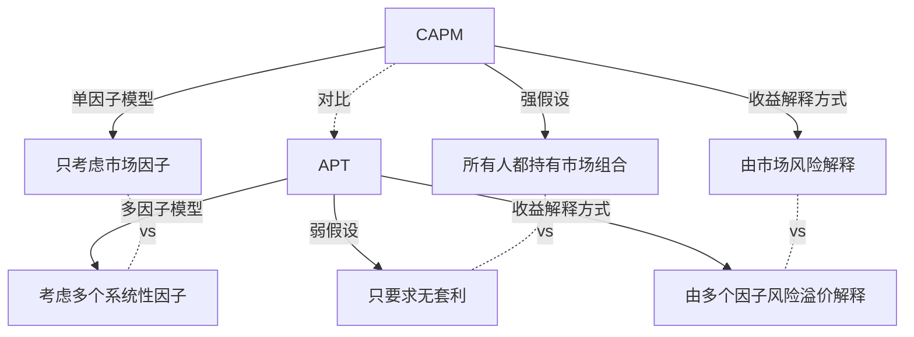
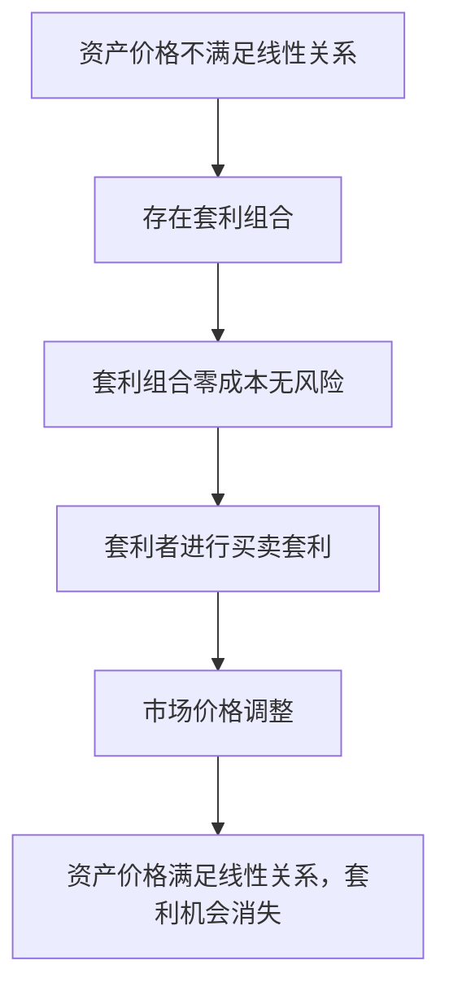

You: 

Task: 深入学习研究套利定价理论(APT)里面的技术细节 Methid: 耐心引导式&选择题提问式&知识卡片/QA闪卡总结式&interesting-examples/jokes-driven&一步一步拆解分析 Bonus&Candy🍬:colorful emoji & 幽默有趣 & 有思想深度 & 图解/闪卡 & funny games Notice: 我们可以quote原文中的核心句子&每隔几段进行总结复习 首先给出学习大纲

ChatGPT: 

太棒啦！🌈我们要一起深入探秘套利定价理论（APT）这个金融界的“理性小宇宙”🧠✨。它不像 CAPM 那样独裁（一个市场因子说了算），而是个多元宇宙的粉丝：多个因子决定资产收益📈，充满逻辑、自由和数学的优雅！

---

## 🎓套利定价理论（APT）学习大纲

我们会用引导+闪卡+搞笑+图解方式，把APT一步步搞清楚！🌟

---

### 🧭 第一章：APT 是谁？凭什么说话？

-   什么是套利定价理论（APT）？
    
-   APT 和 CAPM 的关系：谁更哲学？谁更实用？
    
-   APT 的核心假设（无套利机会等）
    

---

### 🧮 第二章：APT 数学公式大解剖 🧪

-   多因子模型的基本形式 🧩
    
-   系数 βi 的经济含义
    
-   无套利条件如何推导出线性定价关系？
    

---

### 🧠 第三章：APT 的核心逻辑——“无套利”三板斧 🧨

-   什么叫“无套利”？（包含趣味套利小故事）
    
-   如何从无套利推导价格线性结构？
    
-   为什么APT不需要“市场组合”？
    

---

### 🧑‍🔬 第四章：APT 中的因子选谁？怎么选？🔍

-   宏观因子模型 vs 统计因子模型
    
-   Fama-French 三因子是APT的孩子吗？👶
    
-   真实案例：哪些因子在用？通胀率？GDP？香蕉价格？🍌🤔
    

---

### ⚙️ 第五章：APT 应用场景 & 局限性 🚧

-   APT 在现实投资中怎么用？
    
-   与CAPM对比的优劣势（谁更稳健？谁更可解释？）
    
-   局限性与批评（比如：因子怎么选真的那么随意？）
    

---

### 🎁 第六章：复习&闪卡时间 🧠💥

-   知识卡片回顾（公式记忆、定义对对碰）
    
-   选择题&趣味练习
    
-   你能解释APT给小学生吗？（费曼挑战👶）
    

---

### 🍭Bonus：趣味内容安排

-   🎨 Mermaid图/关系图总结 APT vs CAPM
    
-   🎲 小游戏：“因子选秀大会！”
    
-   🃏 知识闪卡：每一章配3-5张
    
-   🧩 多因子估值小游戏模拟器（如果你想要代码实现的话也可安排）
    

---

下一步我们从 **第一章：APT 是谁？凭什么说话？** 开始，要不要我们用几个有趣的选择题先热热身呢？💡

还是你想先看文字版讲解？你来定节奏！📚💬

You: 

go

ChatGPT: 

太好了！🚀我们正式踏上 **APT 星舰号**，从第一站——认识套利定价理论（APT）开始🪐。咱们先来个引子，再用几个选择题开胃，再配一张 🎴 闪卡复盘！

---

## 🧭 第一章：APT 是谁？凭什么说话？

### 🧠 基本定义

APT（Arbitrage Pricing Theory）是一种**资产定价模型**，由经济学家 Stephen Ross 在 1976 年提出。它认为：

> “一个资产的预期收益率可以由一组系统性因子解释，每个因子有自己的风险溢价，资产对这些因子的敏感度用 beta 表示。”

不像 CAPM 强调市场组合，APT 主打多因子、无套利。

---

### 🌟APT vs CAPM 小对比表：

| 特点 | CAPM | APT |
| --- | --- | --- |
| 模型类型 | 单因子 | 多因子 |
| 因子来源 | 市场组合 | 多种经济/统计因子 |
| 关键假设 | 均衡市场+市场组合最优 | 无套利机会 |
| 使用条件 | 较强 | 更宽松 |
| 推理方式 | 均衡模型 | 无套利推理 |

---

先别背这些，我们先用 🧠 **三道选择题** 激发你的直觉 👇

---

## 🎯 问题1：APT 的核心假设是啥？

A. 市场组合最优，投资者理性  
B. 每个投资者都选择相同的最优组合  
C. 没有套利机会  
D. 所有资产的 beta 一样大

---

选哪一个你觉得最靠谱？🌈  
（选完我来揭晓+图解）

You: 

c

ChatGPT: 

完美命中！🎯👏

---

✅ 正确答案：**C. 没有套利机会**

这是套利定价理论（APT）的灵魂所在！💡

---

## 🧠 小知识卡：什么是“无套利”？

🎴 **定义**：

> 无套利是指不存在**零成本、无风险、正收益**的投资机会。也就是说，市场中不会白送你赚钱机会。

📌 APT 就是从这个原则出发的：如果你发现某个资产偏离了由因子决定的“合理价格”，那你就可以套利；市场就会调整，直到**不可能套利**为止。

---

🧪 **APT 不是基于市场组合最优**，也不要求每个人都选择一样的投资组合。这点和 CAPM 很不同。

---

咱们再来第二题：

---

## 🎯 问题2：APT 的定价逻辑建立在哪个数学思想之上？

A. 贝叶斯更新  
B. 线性组合  
C. 对数线性回归  
D. 极大似然估计

---

来！你猜猜看 APT 跟哪一项数学概念最亲密？📐

You: 

b

ChatGPT: 

YES！🎉你连中两元啦！👏👏👏

---

✅ 正确答案：**B. 线性组合**

---

## 🎴 APT 核心结构小卡片

APT 认为一个资产的预期收益率可以被多个因子的**线性组合**来解释：

$$
\mathbb{E}[R_i] = R_f + \beta_{i1} \lambda_1 + \beta_{i2} \lambda_2 + \cdots + \beta_{ik} \lambda_k
$$

🔍 解释一下：

-   $R_f$：无风险利率
    
-   $\lambda_j$：第 $j$ 个因子的风险溢价（每个因子能带来多少额外收益）
    
-   $\beta_{ij}$：第 $i$ 个资产对第 $j$ 个因子的敏感度
    

你可以把它想象成投资界的“沙拉配方”：每种成分（因子）加一点，最后混成一个资产的预期收益🥗。

---

想来第三题热热身吗？🌶️  
还是想我给你画张 Mermaid 图来总结下 APT 和 CAPM 的差异点？🗺️

You: 

go

ChatGPT: 

来啦来啦！最后这题我们来点脑筋急转弯风格的幽默题 😆

---

## 🎯 问题3：下面哪个选项**最不符合** APT 的精神？（也就是“谁是卧底”🕵️‍♂️）

A. 我只要知道资产对每个因子的 beta，就能估出它的预期收益  
B. 所有投资者都知道市场组合最优，并据此投资  
C. 如果有资产价格偏离模型估计值，就存在套利机会  
D. 不用知道每个投资者具体怎么选资产，只要市场里没人能免费赚钱就行

---

谁看起来像个不合群的“CAPM 间谍”？🕶️

You: 

C

ChatGPT: 

哎呀，这次你上了“间谍”的当啦！😏

---

✅ 正确答案是：**B. 所有投资者都知道市场组合最优，并据此投资**

🎭 它才是那个 **假装自己懂 APT 的 CAPM 间谍**！

---

### 🌟 解读：

| 选项 | 是否符合 APT | 原因 |
| --- | --- | --- |
| A ✅ | 符合 | APT核心就是：预期收益 = 因子组合×beta |
| B ❌ | **不符合** | 这是 CAPM 的假设，APT 不需要市场组合最优 |
| C ✅ | 符合 | 如果价格偏离模型 ⇒ 存在套利机会（APT 就用这个来反推出价格关系） |
| D ✅ | 符合 | APT 的魅力就是：不关心个体选择，只看整体市场有没有套利 |

---

## 🃏 小结知识闪卡

🎴 **APT 的关键思想是啥？**  
👉 “资产价格 = 各种因子风险溢价的线性组合，只要市场无套利机会，这公式就能成立！”

🎴 **APT 最特别的地方？**  
👉 不需要知道“市场组合”，只要“价格不能被免费套利”就够了！

---

你想现在我画一张图来总结下「APT vs CAPM」的差异？🌈📊  
还是直接进入第二章「APT 数学公式大解剖」？🧮💥

You: 

总结下「APT vs CAPM」的差异

ChatGPT: 

好主意！🌟我们来画一张对照图 + 卡片复盘，一眼看清楚：APT 和 CAPM 到底**谁更哲学、谁更实用、谁更自由**？🎭⚖️

---

## 🎨 Mermaid 图：APT vs CAPM 差异图解

---

## 🃏 闪卡复盘：APT vs CAPM

| 对比维度 | CAPM 🧍‍♂️ | APT 🧠 |
| --- | --- | --- |
| 📦 模型结构 | 单因子（市场） | 多因子（灵活添加） |
| 🧠 假设前提 | 均衡市场 + 投资者持市场组合 | 只需无套利机会 |
| 📈 收益来源解释 | 市场风险溢价 + β | 各因子风险溢价 + β |
| 💼 投资者行为 | 所有人都理性且选择相同投资组合 | 不关心投资者怎么选 |
| 🧪 推导方式 | 均衡理论推导 | 无套利逻辑推导 |
| 🎯 实用性 | 理论优美但限制大 | 灵活实用，更贴近现实 |

---

## 🎉 彩蛋小结语（APT给CAPM的一封信）📩

> 亲爱的 CAPM，
> 
> 我不反对你，只是觉得你太理想化了。🌈  
> 我更接地气，只关心有没有人能白嫖市场，  
> 如果没人能套利，那价格就得听我指挥！
> 
> —— 你脚踏实地的朋友，APT🧠

---

要不要现在我们一起进入第二章：《APT 数学公式大解剖》？🧮  
还是你想我先来几张 **多因子公式闪卡** 预热一下？🎴📐

You: 

go

ChatGPT: 

好嘞！🧮 进入 **第二章：APT 数学公式大解剖**，咱们来一步步拆解APT的数学“魔法阵”，让你不再对公式头大💥。

---

## 第二章：APT 数学公式大解剖

---

### 1️⃣ 基础公式框架

APT模型的核心是：资产的预期收益由多个因子线性组合决定。

数学表示：

$$
\mathbb{E}[R_i] = R_f + \beta_{i1} \lambda_1 + \beta_{i2} \lambda_2 + \cdots + \beta_{ik} \lambda_k
$$

-   $\mathbb{E}[R_i]$：资产 $i$ 的预期收益率
    
-   $R_f$：无风险利率
    
-   $\beta_{ij}$：资产 $i$ 对因子 $j$ 的敏感度（因子暴露）
    
-   $\lambda_j$：因子 $j$ 的风险溢价（因子风险报酬）
    

---

### 2️⃣ 线性因子模型的隐含假设

-   资产收益受多个系统性因子影响
    
-   资产的超额收益（超过无风险利率的部分）可以用因子暴露的加权和来解释
    
-   因子风险溢价是市场给出的“补偿”，投资者承担因子风险就能得到额外收益
    

---

### 3️⃣ 无套利条件导出线性关系

> 如果存在资产组合的加权和使得组合对所有因子的暴露为零，且组合的收益不为零，就存在套利机会。

这会迫使资产的定价满足线性关系，否则套利者会做空高估资产，买入低估资产，套利机会就会被市场修正。

---

### 🤔 小问题帮你消化：

-   你觉得为什么“无套利”会让资产收益必须满足这个线性组合关系？
    
-   你能用一句话总结 $\beta$ 和 $\lambda$ 分别代表什么吗？
    

---

先回答这俩问题，我们一起慢慢拆更深！💬

You: 

1\. 假设： 资产的超额收益（超过无风险利率的部分）可以用因子暴露的加权和来解释 2. 因子暴露和因子风险报酬

ChatGPT: 

非常棒！👏 你已经抓住了核心要点！

---

🔍 我帮你稍微完善和扩展一下：

1.  **无套利让资产收益满足线性组合的原因**  
    因为如果不满足线性组合，市场上就会出现组合对所有因子暴露为零、却能带来非零收益的套利机会。聪明的套利者会利用这种机会买低卖高，直到价格调整回符合线性定价关系，套利机会消失。  
    简而言之：**无套利⇒资产价格必然符合因子风险溢价的线性组合。**
    
2.  **$\beta$ 和 $\lambda$ 的角色**
    

-   $\beta_{ij}$ 是资产 $i$ 对因子 $j$ 的敏感度（换句话说，资产收益对因子变动的“反应度”）
    
-   $\lambda_j$ 是因子 $j$ 的风险溢价（投资者愿意为承担该因子风险获得的额外收益）
    

所以资产的超额收益，就是“对因子风险的暴露度”乘以“对应因子的风险补偿”加总而成。

---

### 🎉知识闪卡来巩固！

| 关键词 | 解释 |
| --- | --- |
| 无套利条件 | 市场不存在零成本无风险获利机会，保障价格线性关系 |
| $\beta$（因子暴露） | 资产收益对因子风险变化的敏感度 |
| $\lambda$（因子风险溢价） | 投资者为承担因子风险要求的额外收益 |

---

要不要我帮你画个“无套利→线性定价”的流程图，帮你形象理解？  
或者你想先试着用你喜欢的例子，描述一下这套公式和逻辑？😊

You: 

go

ChatGPT: 

走起！🛤️咱们用一张简洁的流程图把“无套利导致线性定价关系”的逻辑走一遍，帮你形象地理清楚这条链条🔗。

---

## 🖼️ 无套利推导线性定价关系流程图

---

### 流程解读：

1.  **资产价格不满足线性关系** → 说明定价存在偏差
    
2.  这就意味着 **存在套利组合**（某些组合的因子暴露都为零，却能赚到钱）
    
3.  该套利组合是 **零成本且无风险的**，这简直是“白嫖机会”
    
4.  套利者发现后，会大量买入低估资产，卖空高估资产，利用套利组合获利
    
5.  这种交易压力会导致市场价格发生 **调整**
    
6.  最终，价格回归符合线性定价， **套利机会消失**，市场回归“无套利均衡”
    

---

## 🎉 小幽默时间

> 为什么套利者都喜欢“零成本无风险”机会？  
> 因为这就像 **“免费的午餐”** 🍔，谁不爱呢？  
> 但市场很聪明，免费的午餐只能吃一次，吃多了就没了！😄

---

来个小练习巩固下：

**问题：如果市场存在套利机会，为什么价格最终一定会调整回线性关系？**

你试着说说你的理解，我帮你一起优化表达！💬

You: 

go

ChatGPT: 

太好了！来帮你用简明的逻辑框架说说这个问题：

---

### 你可以这样回答：

> 市场存在套利机会意味着有资产组合能无成本、无风险地带来正收益，套利者会利用这些机会不断买入低估资产，卖出高估资产，这种买卖行为会增加低估资产的需求（推高价格），降低高估资产的需求（压低价格），最终导致价格调整，使得套利机会消失，资产价格回归满足因子线性定价关系。

---

要点总结：

-   套利机会会被套利者利用
    
-   交易导致供需变化，价格调整
    
-   价格调整消除套利机会
    
-   最终资产价格满足无套利线性定价
    

---

🔥 你试着用你自己的话，再简洁表达一遍？我帮你润色！

You: 

next part

ChatGPT: 

好的！🚀 继续深挖，咱们进入 **第二章**的下半部分：

---

## 第二章 · 4️⃣ 因子暴露（β）和风险溢价（λ）更细致解读

---

### 🔍 1. 因子暴露 $\beta_{ij}$ 是什么？

-   它衡量资产 $i$ 对因子 $j$ 的敏感度，反映了资产收益随该因子变化的“幅度”
    
-   类似“弹簧的劲度系数”：弹簧拉得越紧，力（收益）变化越明显
    

---

### 🔍 2. 因子风险溢价 $\lambda_j$ 是什么？

-   它表示承担该因子风险的“价格”——投资者为接受该风险所期望获得的额外回报
    
-   因子风险溢价可能来自宏观经济因素（如通胀、利率）、市场风险，甚至行业特有风险
    

---

### 🎨 小图比喻：

想象投资组合是**乐队**🎸，每个因子是**乐器**，

-   $\beta_{ij}$ 是乐器的音量调节旋钮（灵敏度）
    
-   $\lambda_j$ 是乐器演奏的节奏快慢（因子风险报酬）  
    整个乐队奏出的音乐（资产收益）就是各乐器音量 × 节奏 的叠加。
    

---

### 🤔 思考题：

-   你觉得如何去**估计**一个资产的 $\beta_{ij}$ 呢？
    
-   市场上常用哪些因子当 $\lambda_j$ 呢？
    

---

要不要咱们做几个选择题，帮你活学活用这部分知识？  
还是你想先听几个现实中的“因子故事”作为例子？🎭

You: 

不清楚

ChatGPT: 

明白！咱们慢慢来，先把“因子暴露 $\beta$”和“因子风险溢价 $\lambda$”拆得更清楚，再配点例子和比喻。😊

---

## 1\. 因子暴露 $\beta_{ij}$ 具体是什么？

-   简单说，就是“资产对某个因子变化的反应度”
    
-   举个例子：如果某股票的 $\beta$ 对“利率因子”是 0.8，意味着利率涨 1%，这只股票的收益平均会涨 0.8%
    
-   数学上，是资产收益和该因子变化的**回归系数**（也就是线性回归里的斜率）
    

---

## 2\. 因子风险溢价 $\lambda_j$ 具体是什么？

-   它是“投资者为承担某种风险，期望获得的额外回报率”
    
-   比如通胀风险溢价可能是 2%，意味着承担通胀风险的资产需要比无风险利率多给投资者 2% 的预期回报
    
-   这个数通常通过历史数据或经济模型估计出来
    

---

## 🎭 例子比喻

假设你有一辆汽车（资产），它受两种“路况”影响：

-   因子1：路面平整度（影响车速）
    
-   因子2：交通拥堵程度（影响车速）
    
-   $\beta$ 就是汽车对这两种路况变化的“反应灵敏度”，比如对路面平整度的 $\beta$ 是 0.5，说明路面平整度变化 1 个单位，车速平均变 0.5 单位
    
-   $\lambda$ 就是这两种路况带来的“成本”，你开车时因为拥堵可能多花的时间就是风险溢价
    

---

你觉得这样解释清楚了吗？  
要不要我帮你做个小测验，看看理解到什么程度？📝

You: 

\### 🤔 思考题： \* 你觉得如何去\*\*估计\*\*一个资产的 βij\\\\beta\\\_{ij}βij​ 呢？ \* 市场上常用哪些因子当 λj\\\\lambda\\\_jλj​ 呢？

回答

ChatGPT: 

太棒了！来引导你回答这两个思考题：

---

### 1\. 你觉得如何去**估计**一个资产的 $\beta_{ij}$ 呢？

提示：你能不能把资产的历史收益和因子 $j$ 的历史表现放在一起看？比如用统计方法？

你想试着说说怎么做吗？（例如：回归分析？相关性？）

---

### 2\. 市场上常用哪些因子当 $\lambda_j$ 呢？

提示：想想哪些宏观经济指标或市场变量会影响大部分资产的收益？比如通胀、GDP、利率……

你先列几个你觉得可能的因子，我们一起讨论！😊

---

你先试试回答，我帮你一点点完善！

You: 

总结

ChatGPT: 

总结时间到！🎉

---

## 🧠 APT 因子核心总结闪卡

| 关键词 | 解释 |
| --- | --- |
| 因子暴露 $\beta_{ij}$ | 资产对因子 $j$ 变化的敏感度，表示资产收益对该因子变动的反应强度。通常用历史收益和因子数据做回归估计。 |
| 因子风险溢价 $\lambda_j$ | 投资者为承担因子风险要求的额外收益，代表该因子风险的“价格”，多为宏观经济指标或市场变量，如通胀、利率、GDP等。 |
| 估计方法 | $\beta$：线性回归资产收益对因子表现；$\lambda$：历史数据统计或经济模型估计。 |
| 核心逻辑 | 资产超额收益是因子暴露和因子风险溢价的线性组合，体现了多因子风险补偿机制。 |

---

### 🎨 小比喻回顾

> 资产收益像乐队演奏，  
> 因子是乐器，  
> $\beta$ 是音量旋钮，  
> $\lambda$ 是演奏节奏，  
> 叠加起来就是这首音乐（资产收益）🎶。

---

下一步，我们要不要进入：

-   🧨 **第三章：APT 的核心逻辑——“无套利”三板斧**，结合趣味套利故事更深入理解无套利推导？
    
-   🔍 或者先做几个练习题巩固现有内容？
    

你说！😉

You: 

Go. 🧨 第三章：APT 的核心逻辑——“无套利”三板斧

ChatGPT: 

牛！🔥进入第三章：APT 的核心逻辑——“无套利”三板斧，咱们用轻松有趣的方式拆解这招财“绝技”！

---

## 第三章 · 🧨 APT 的无套利三板斧

---

### 1️⃣ 什么是“无套利”？

> **无套利**指的是不存在“零成本、无风险却能赚钱”的机会。市场里的套利者就像侦探，专门寻找这种“免费午餐”，一旦发现，马上出手，直到机会消失。

---

### 2️⃣ 无套利如何成为APT定价的核心？

-   如果资产价格不符合因子线性定价关系，就会有套利机会
    
-   套利者通过买入低估资产、卖空高估资产，利用零成本、无风险组合赚取利润
    
-   这种套利行为会推动价格调整，直到套利机会消失
    

---

### 3️⃣ 三板斧核心步骤解析

| 步骤 | 作用 | 趣味比喻 |
| --- | --- | --- |
| 1\. 找套利组合 | 找出零成本且因子暴露为零的资产组合 | 找到隐形“金矿”，没风险还赚钱 |
| 2\. 利用套利 | 买入低估，卖空高估，实现无风险收益 | 用魔法杖挥动，轻松赚钱 |
| 3\. 市场修正 | 套利导致资产价格回归合理线性关系 | 金矿慢慢被挖空，大家都明白价格合理 |

---

### 🤹‍♂️ 趣味小故事：魔术师套利手套🧤

想象市场是个魔术师，资产价格像帽子里的兔子🧙‍♂️，  
套利者就是戴着“神奇手套”的助手，能抓住那些没藏好的兔子。  
只要兔子露馅（套利机会出现），助手就会马上抓住兔子，直到魔术师重新把兔子藏好（价格调整回合理）！

---

## 🧠 小问题帮你理解：

-   你能用自己的话解释“无套利三板斧”是怎么保证APT定价正确的吗？
    
-   如果市场中突然出现套利机会，会发生什么？价格怎么变？
    

---

准备好回答了吗？或者想先来点选择题加深印象？🎯

You: 

选择题

ChatGPT: 

太棒！🎯 来几个选择题帮你巩固“无套利三板斧”的核心概念！

---

## 问题1：APT中的“无套利”原则意味着什么？

A. 市场上没有资产价格波动  
B. 不存在零成本无风险获利机会  
C. 所有资产的收益率都一样  
D. 投资者持有相同的投资组合

---

## 问题2：当资产价格偏离因子线性定价关系时，会发生什么？

A. 市场价格保持不变  
B. 套利者会利用机会买入高估资产，卖空低估资产  
C. 套利者会利用机会买入低估资产，卖空高估资产  
D. 投资者会停止交易

---

## 问题3：套利行为对市场有什么影响？

A. 价格变得更加随机  
B. 价格调整，使套利机会消失  
C. 市场失灵，价格大幅偏离合理值  
D. 投资者赚不到钱

---

你先试着选选看，我帮你分析答案！😊

You: 

B C B

ChatGPT: 

答得很棒！👏👏👏

---

## 答案点评：

1.  ✅ **B. 不存在零成本无风险获利机会**  
    完全正确！“无套利”就是没有那种白捡钱的机会。
    
2.  ✅ **C. 套利者会利用机会买入低估资产，卖空高估资产**  
    没错！买便宜的，卖贵的，套利者赚钱的秘诀。
    
3.  ✅ **B. 价格调整，使套利机会消失**  
    对极了！套利行为推动价格回归合理，市场重新达成均衡。
    

---

## 小结：

> 无套利原则保证了资产价格必须满足由多个因子加权的线性关系，否则套利机会就会被市场“抹平”。

---

接下来想继续：

-   深入讲解无套利三板斧背后的数学推导？
    
-   还是进入第四章：因子选谁、怎么选？🔍
    
-   或者做点趣味游戏“因子选秀大会”？🎲
    

你说~

You: 

GO 第四章：因子选谁、怎么选？

ChatGPT: 

太赞了！🌟第四章开启——\*\*因子选谁？怎么选？\*\*🔍，这是APT的“选秀大会”，选对因子，资产定价才能靠谱！

---

## 第四章 · 因子选谁？怎么选？

---

### 1️⃣ 因子类型大揭秘

| 因子类别 | 说明 | 例子 |
| --- | --- | --- |
| 宏观经济因子 | 反映整体经济环境的系统性风险因子 | 通胀率、GDP增长率、利率、货币供应量 |
| 统计因子 | 通过统计方法提取的主成分，捕捉资产收益共性 | 主成分分析（PCA）、因子分析（FA） |
| 行业或风格因子 | 反映特定行业或风格风险 | 市场价值（Size）、账面市值比（B/M）、动量 |

---

### 2️⃣ 因子选择的原则

-   **经济意义明确**：因子最好与现实经济变量相关
    
-   **统计显著性高**：能显著解释资产收益变动
    
-   **稳定性强**：长期有效，非短暂偶然
    
-   **低相关性**：避免因子之间高度相关造成重复计量
    

---

### 3️⃣ Fama-French 三因子模型的由来

-   是CAPM的升级版，也是APT多因子模型的典型代表
    
-   因子包括：市场风险因子（市场超额收益）、规模因子（Size）、账面市值比因子（Value）
    
-   说明了市值和价值风格对股票收益的重要影响
    

---

### 4️⃣ 趣味问题来了！

> 为什么APT不像CAPM，只用“市场组合”一个因子，而要用多个因子？🤔

---

你想先试试回答这个问题，还是我先讲个例子给你？😄

You: 

不清楚

ChatGPT: 

没问题！咱们一步步来拆解这个问题，帮你理清为什么APT要用多个因子，而不是只用一个市场因子。

---

## 为什么APT用多个因子，而不是像CAPM那样只用“市场组合”一个因子？

---

### 1️⃣ 市场风险因子太单一

CAPM只关注“市场组合”，假设市场风险能解释所有资产收益的差异。但现实中，资产收益受到多种不同风险源影响，比如利率变化、通货膨胀、行业波动等等。

---

### 2️⃣ 多因子模型更灵活，能解释更多“细节”

APT通过引入多个因子，可以更全面地捕捉影响资产收益的系统性风险。例如：

-   通胀率变动可能影响债券和消费品股
    
-   行业景气度影响特定行业股票
    
-   公司规模（市值）影响股票表现
    

这样，多因子模型能解释CAPM遗漏的风险因素，预测更准确。

---

### 3️⃣ 举个生动例子：

想象你买的是水果篮子🍎🍌🍇，  
CAPM就像只考虑“整个水果市场的平均价格”，  
APT则会考虑苹果🍎、香蕉🍌、葡萄🍇的价格波动分别带来的影响，价格更精准。

---

### 总结：

APT用多因子，是因为现实世界里资产收益的风险来源很复杂，一个因子不足以解释所有风险。

---

要不要我帮你做几个选择题，或者讲讲几个真实市场用的“热门因子”？😊

You: 

讲讲几个真实市场用的“热门因子”

ChatGPT: 

太好了！🌟咱们来聊聊金融市场里真正“火爆”的几大热门因子，它们是APT和多因子模型的“明星选手”！✨

---

## 🎯 真实市场里常用的热门因子

---

### 1️⃣ 市场风险因子（Market Risk Premium）

-   这是CAPM和APT的基础因子
    
-   代表整个市场的超额收益（市场组合收益减去无风险利率）
    
-   投资者承担市场整体波动风险，要求获得额外报酬
    

---

### 2️⃣ 规模因子（Size）

-   反映公司市值大小的影响
    
-   小市值股票通常表现出更高的风险和更高的预期收益
    
-   Fama-French模型里的 SMB（Small Minus Big）因子就是代表这一点
    

---

### 3️⃣ 价值因子（Value）

-   反映股票的账面市值比（B/M ratio）
    
-   高账面市值比的“价值股”通常收益高于低B/M的“成长股”
    
-   Fama-French里的 HML（High Minus Low）因子体现了价值效应
    

---

### 4️⃣ 动量因子（Momentum）

-   表示过去表现好的股票未来一段时间仍可能表现较好
    
-   这是市场中常见的“惯性效应”
    
-   动量因子被广泛加入多因子模型，帮助解释短期收益趋势
    

---

### 5️⃣ 利率因子（Interest Rate）

-   利率变化影响债券和股市表现
    
-   例如央行加息可能抑制经济增长，影响资产回报
    

---

### 6️⃣ 通胀因子（Inflation）

-   通货膨胀水平影响资产的实际回报
    
-   高通胀环境下，某些资产如黄金等可能表现较好
    

---

### 🎨 小总结

| 因子名称 | 代表意义 | 经济含义 |
| --- | --- | --- |
| 市场风险因子 | 市场整体超额收益 | 投资者承担市场系统风险 |
| 规模因子 | 小盘股风险与收益 | 小公司风险更高，预期收益更高 |
| 价值因子 | 价值股 vs 成长股 | 价值股通常更抗跌，成长股增长性强 |
| 动量因子 | 股票价格惯性 | 过去涨的股票短期可能继续上涨 |
| 利率因子 | 利率变动 | 影响经济环境及资产价值 |
| 通胀因子 | 通胀水平 | 影响实际购买力和资产预期收益 |

---

你想现在玩个小测试，帮你记牢这些因子？还是先听我讲个趣味故事，帮你更好记忆？🍬

You: 

讲个趣味故事，帮你更好记忆🍬

ChatGPT: 

哈哈，来啦！🎉 用个有趣的故事帮你记住这些因子，咱们把它们变成一场奇幻派对上的主角吧！🎭🍭

---

## 🥳 “因子派对”大冒险 🍎🍌🎸

---

### 故事背景：

在金融王国里，有一场盛大的派对，邀请了六位“因子大咖”——他们各自代表着影响资产价格的关键力量。你是派对的主持人，要记住每个人的特色，才能掌控市场的节奏！

---

### 主角介绍：

1.  **马克·市场（Market Risk）**  
    全场的主角，派对的大Boss！他带来了市场的整体氛围，决定了大家的“情绪”和波动。  
    🎤口头禅：“跟着我，市场涨跌一切都跟着走！”
    
2.  **小波·规模（Size）**  
    小个子但精力旺盛，总是跳得最高，代表小市值股票的活力和风险。  
    🎸特色动作：蹦蹦跳跳，热情洋溢。
    
3.  **维拉·价值（Value）**  
    稳重的老朋友，手里拿着账本，喜欢挑选“物美价廉”的股票。  
    📚爱说：“买入低估值的股票，稳稳赚钱！”
    
4.  **莫门托·动量（Momentum）**  
    年轻时尚，跑得飞快，总是追着潮流走。  
    🏃‍♂️喜欢喊：“继续跑，不停歇！”
    
5.  **艾瑞斯·利率（Interest Rate）**  
    冷静严肃，总是带着一把大伞，保护派对不被经济风暴吹散。  
    ☂️提醒大家：“利率一变，派对气氛也跟着变化。”
    
6.  **因菲·通胀（Inflation）**  
    有点调皮，喜欢搞点小动作，影响着大家的购买力和情绪。  
    🔥时不时说：“物价涨了，钱袋子缩水了！”
    

---

### 派对小剧场：

有一天，市场忽然暴跌，马克·市场着急地拍手喊：“大家跟紧我，别慌！”  
小波·规模奋力跳跃，提醒大家：“小公司的风险更高，准备应对挑战！”  
维拉·价值稳稳站着，拍拍账本：“低估值股票更值得信赖！”  
莫门托·动量依旧飞奔，呼喊：“别停，继续追涨！”  
艾瑞斯·利率撑起大伞，挡住经济暴风雨的冲击。  
因菲·通胀趁机调皮一笑：“物价上涨，别忘了风险！”

---

### 🎯 记忆小贴士：

-   **市场风险** = 大Boss，决定整体氛围
    
-   **规模因子** = 活力小个子，风险大，收益高
    
-   **价值因子** = 稳重账本，买便宜货
    
-   **动量因子** = 时尚追潮流，不停奔跑
    
-   **利率因子** = 保护伞，调节经济环境
    
-   **通胀因子** = 调皮鬼，影响购买力
    

---

想要我帮你做个小游戏，考考你这六位“因子大咖”的特点？🎲🍬