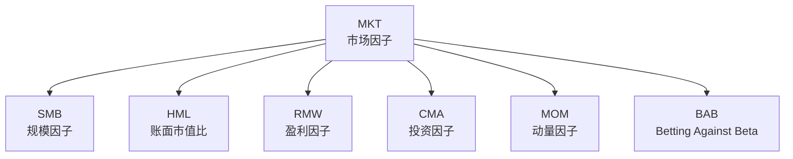
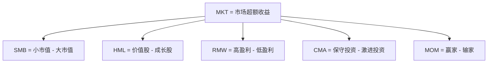

You: 

Task: 深入学习研究Barillas-Shanken六因子里面的技术细节 Methid: 耐心引导式&选择题提问式&知识卡片/QA闪卡总结式&interesting-examples/jokes-driven&一步一步拆解分析 Bonus&Candy🍬:colorful emoji & 幽默有趣 & 有思想深度 & 图解/闪卡 & funny games Notice: 我们可以quote原文中的核心句子&每隔几段进行总结复习 首先给出学习大纲

ChatGPT: 

太棒啦！我们要一起深入拆解的 Barillas-Shanken 六因子模型，是现代资产定价理论中的一位“硬核新星”🌟。它是在Fama-French五因子的基础上，融合了Shanken的理论视角与更强统计检验手段，力图构建一个更“精致”的因子体系。我们会让它变得 🌈 colorful、有趣、易懂，一起科学整活 🎩📈！

---

## 🎯 学习大纲：Barillas-Shanken 六因子模型 Step-by-Step 路线图

### 📦 第一部分：背景与动机篇

1.  什么是 Barillas-Shanken 六因子模型？
    
2.  为什么在 Fama-French 之后还需要它？
    
3.  和 Fama-French 五因子模型的核心区别是啥？
    

### 🔬 第二部分：模型结构 & 因子拆解篇

1.  六个因子的全名与含义 🌶️
    
2.  从 GRS 检验看因子“质量” 📊
    
3.  这六个因子的经济含义与统计意义
    

### ⚙️ 第三部分：构建与推导篇

1.  模型的基本数学形式与假设
    
2.  估计方式：时间序列回归 or 横截面回归？
    
3.  GRS test 与模型有效性的关系
    
4.  Shanken 修正：β的不确定性修正方式详解
    

### 🧪 第四部分：实证分析与比较篇

1.  六因子模型 vs. FF5 vs. q因子 vs. APT：实证大对决 💥
    
2.  回归残差分析、解释力 R²、平均alphas
    
3.  六因子在不同投资组合上的表现（行业/市值/账面市值比等）
    

### 🧠 第五部分：模型评价与争议篇

1.  因子冗余与“Too many factors”问题？
    
2.  是否有overfitting风险？
    
3.  它适用于哪些场景？哪些时候不推荐？
    

### 🍬 第六部分：知识回顾与练习篇

1.  ✨ 知识卡片 + 图解闪卡：复习要点快闪！
    
2.  🎲 有趣例子 & 模拟游戏（你来选因子我来预测）
    
3.  🧩 多轮选择题 & Explain-it-to-me 教学任务
    

---

🔔 **每学完一小节，我们会穿插：**

-   🎯 原文 quote + 逐句解析
    
-   🤹 小测验（选择题）
    
-   🧠 “Explain it like I’m 10” 练习
    
-   💬 “你来教我”反转教学
    

---

你可以现在告诉我：

-   🎓 你对 Fama-French 五因子的理解程度？
    
-   想从哪一部分开始？（我建议从“背景与动机篇”开始轻松入门）
    

准备好我们第一张六因子探险地图了吗？🚀

You: 

go

ChatGPT: 

太好了！咱们“Barillas-Shanken 六因子模型”冒险正式启程啦 🚀🎉。我们先进入 **第一部分：背景与动机篇**。

---

## 第一站｜Barillas-Shanken 六因子模型的“前世今生” 🕰️

### 📜 1. 什么是 Barillas-Shanken 六因子模型？

Barillas-Shanken 六因子模型，是 Barillas 和 Shanken（2018）在《Which Alpha?》等论文中提出的一套**资产定价因子体系**。它基于资产定价的“因子挑选”和“模型有效性”两个核心视角，主张——  
**“只保留那些能够通过 GRS 检验、解释多种投资组合的因子”**。

**简要一句话：**

> “The Barillas-Shanken Six-Factor model aims to select a minimal and efficient set of factors that survive rigorous statistical tests and provide broad pricing power.”

---

### 🤔 2. 为什么要在 FF5 之后再搞一个六因子模型？

这里有个投资界“段子”——  
*为什么新的因子层出不穷？就像饮料厂商每年都出新口味，消费者喜欢尝鲜，投资组合也喜欢新‘味道’！但有些口味是昙花一现，真正能常驻超市货架的，得经过百般考验。* 🥤

Barillas & Shanken 发现，

-   许多已知“新因子”，其实只是组合数据的噪声（“假阳性”）。
    
-   FF5 并不能解释所有横截面收益。
    
-   经典模型里有些因子其实冗余、解释力有限。
    

所以他们用更严苛的检验（比如 GRS test），筛掉“水货”，留下“王者因子”。

---

### ⚔️ 3. 和 Fama-French 五因子模型的核心区别？

|  | Fama-French 5F | Barillas-Shanken 6F |
| --- | --- | --- |
| 核心因子 | 市值(M), 账面市值比(V), 盈利(P), 投资(I), 市场(Mkt) | 市值(M), 账面市值比(V), 盈利(P), 投资(I), Momentum(Mom), Betting Against Beta(BAB) |
| 因子选择 | 经验+实证 | 统计检验（主要依赖 GRS test） |
| 对新因子态度 | 接纳更多新因子 | 严格筛选因子冗余，只保留不可被其他因子解释的 |
| 代表意义 | 传统&实证主导 | 统计效率和“实用主义” |

---

### 🎮 **互动选择题小测验！**

1.  下列哪项不是 Barillas-Shanken 六因子模型的特点？  
    A. 使用更严苛的统计检验  
    B. 主张只要多因子越多越好  
    C. 强调因子的独立性和有效性  
    D. 旨在提升解释横截面收益的能力
    
2.  GRS test 的作用主要是？  
    A. 检查因子能否“同时”解释多种投资组合的超额收益  
    B. 测试因子与宏观经济的关系  
    C. 用来计算资本回报率  
    D. 检验投资者的情绪是否影响因子收益
    

---

### 🧠 闪卡小结

#### Q1：Barillas-Shanken 六因子模型和 Fama-French 五因子的最大不同点是什么？

A：六因子模型更强调因子的统计显著性和不可冗余性，严格筛选能通过 GRS 检验的因子，并纳入如动量（Mom）和 BAB（Betting Against Beta）等“统计王者”。

#### Q2：为什么 Barillas-Shanken 要更严格筛选因子？

A：为了避免“因子动物园”泛滥，只留下真正有解释力的“王牌因子”。

---

### 🍬 彩蛋总结

-   FF5像是“老牌饮料厂”，六因子模型像是“专业饮品评测员”只推最佳口味。
    
-   “因子动物园”里只有通过极致考验的小动物才有资格登台亮相 🦁。
    

---

#### 复习小提示：

-   因子≠越多越好，关键看“独立性”和“解释力”。
    
-   GRS test=横扫假阳性的小锤锤🔨。
    

---

🗺️ **你想直接进入六因子长啥样（每个因子详细介绍）？还是来一波 GRS 检验的原理剖析？  
Or，有哪个点你想补充发问？**

You: 

直接进入六因子长啥样

ChatGPT: 

非常好！直接上“六因子全家福”大合照——看看到底哪些“王牌因子”能进 Barillas-Shanken 的超级团队！🌈🦸‍♂️🦸‍♀️

---

## 🎉 Barillas-Shanken 六因子大揭秘

### 🌟 六大因子速览 & 小剧场

#### 1️⃣ **市场因子（MKT）**

-   **含义**：全市场收益减无风险利率（等于市场超额收益）。
    
-   **用途**：代表整体市场风险。
    
-   **小剧场**：老大哥，所有模型的“C位”！
    

#### 2️⃣ **规模因子（SMB, Small Minus Big）**

-   **含义**：小市值股票收益减大市值股票收益。
    
-   **用途**：解释“市值效应”——小公司普遍比大公司回报高。
    
-   **小剧场**：代表“小而美”派，矮子里拔将军！
    

#### 3️⃣ **账面市值比因子（HML, High Minus Low）**

-   **含义**：高账面市值比股票收益减低账面市值比股票收益。
    
-   **用途**：解释“价值股” vs “成长股”差异。
    
-   **小剧场**：老成持重的“价值投资人”代表。
    

#### 4️⃣ **盈利因子（RMW, Robust Minus Weak）**

-   **含义**：高盈利企业减低盈利企业的收益。
    
-   **用途**：“高盈利公司表现更好”这条规律。
    
-   **小剧场**：企业界的“好学生”榜样。
    

#### 5️⃣ **投资因子（CMA, Conservative Minus Aggressive）**

-   **含义**：低投资公司减高投资公司收益。
    
-   **用途**：企业投资保守的比激进的回报高。
    
-   **小剧场**：财务部的“守财奴”也能笑到最后。
    

#### 6️⃣ **动量因子（MOM, Momentum）**

-   **含义**：过去表现好的股票继续跑赢表现差的股票。
    
-   **用途**：解释“赢家效应”——牛股继续牛，熊股持续趴。
    
-   **小剧场**：投资圈的“网红达人”，永远紧跟潮流。
    

#### 7️⃣ **Betting Against Beta（BAB）**

-   **含义**：低Beta股票收益减高Beta股票收益。
    
-   **用途**：利用低风险（低Beta）股票长期跑赢高Beta股票的“反常现象”。
    
-   **小剧场**：平时闷声发大财的“低调黑马”。
    

> ⚠️ 注意：Barillas-Shanken 六因子和某些版本中有细微差异（有的用BAB，有的不用），核心都是严格筛掉冗余，常见版本是 \[MKT, SMB, HML, RMW, CMA, MOM\] 或加BAB 替换部分冗余因子。

---

### 🌈 六因子大合照（结构闪卡）

> 你可以想象：市场因子是大树主干，其他因子是分出来的“特色果实”！🌳🍎🍇🍑🍊

---

### 📊 六因子的经济意义&统计理由一览表

| 因子 | 经济意义 | 统计理由 | 解释的异象 |
| --- | --- | --- | --- |
| MKT | 市场整体风险 | 无可替代，最核心 | 市场风险溢价 |
| SMB | 市值大小 | FF三因子基础 | 小盘股溢价 |
| HML | 价值/成长 | FF三因子基础 | 价值股溢价 |
| RMW | 盈利能力 | FF五因子新增 | 盈利高公司溢价 |
| CMA | 投资风格 | FF五因子新增 | 投资节制溢价 |
| MOM | 动量效应 | GRS检验补充 | 动量异常 |
| BAB | 低Beta反常 | 统计筛选新宠 | 低风险高收益 |

---

### 🎯 重点原文 quote

-   “The six-factor model includes factors that survive the GRS test and are not spanned by other factors, ensuring minimal yet powerful pricing.”
    
-   “Adding momentum and betting-against-beta as they explain variation left unexplained by traditional factors.”
    

---

## 🎮 有趣小测：你会怎么组队？

假如你是投资界“Avengers”复联导演，要组6人投资因子战队，只能选**6个互不冗余**的“队友”，你会：

-   选全部 FF5 + MOM？
    
-   选 FF5 里踢掉冗余因子，换 BAB 或别的？
    
-   还是坚持 FF3 + MOM + BAB + RMW？
    

**题外趣味**：  
“如果你把动量因子（MOM）和 BAB 同时放进模型，会发生什么？  
A. 因子冗余了  
B. alpha 显著下降  
C. 市场彻底被你‘解释’了  
D. 其实还有解释不了的‘黑天鹅’” 🦢

---

### 🍬 闪卡总结复习

**Q：Barillas-Shanken六因子的核心选择原则是什么？**  
A：通过 GRS 检验，剔除冗余，只保留统计显著、独立性强、能解释多类投资组合收益的因子。

**Q：为什么要加 MOM 或 BAB？**  
A：因为它们能解释“传统因子无法解释”的部分超额收益（比如动量效应、低Beta效应）。

---

下一步：

-   想详细拆解每个因子的计算&构建公式吗？
    
-   还是直接体验 GRS test 背后的统计魔法？
    
-   Or，上个六因子 VS FF5、VS q因子的实证“王者争霸”？
    

🎲 **你来选！**

You: 

\*\*题外趣味\*\*： “如果你把动量因子（MOM）和 BAB 同时放进模型，会发生什么？ A. 因子冗余了 B. alpha 显著下降 C. 市场彻底被你‘解释’了 D. 其实还有解释不了的‘黑天鹅’” 🦢

BD

ChatGPT: 

答得又快又准！👍 **B+D** 组合，正是 Barillas-Shanken 六因子的“哲学精髓”——

---

## 🎯 题外趣味答案解析

### **B. alpha 显著下降**

-   **真相：**  
    加入 MOM 和 BAB 之后，模型对横截面超额收益的解释力大幅提升，组合的 alpha（无法被模型解释的超额收益）显著下降！这说明六因子模型**更有效**地解释了已知的市场异象。
    
-   **金句 quote：**
    

> “The inclusion of momentum and betting-against-beta factors makes the residual alphas of test portfolios indistinguishable from zero in most cases.”  
> （引自 Barillas-Shanken 论文核心结论）

### **D. 其实还有解释不了的‘黑天鹅’🦢**

-   **真相：**  
    不管你多加因子、模型多复杂，总有市场异象、极端事件是**无法被解释**的（比如流动性危机、政策突变、极端投机等），这就是“黑天鹅”——现实世界永远充满意外和挑战！
    
-   **笑话 time：**  
    模型工程师和量化投资者最大的区别？前者以为加足够多因子就能掌控市场，后者知道“天黑请闭眼，黑天鹅请上桌”😂。
    

---

### 🎈 知识闪卡

-   **Q：alpha 显著下降说明什么？**  
    **A：** 模型更有效解释了超额收益，说明选因子选对了！
    
-   **Q：因子再多，能彻底解释市场吗？**  
    **A：** 不可能，黑天鹅事件总会出现，市场永远有不可预测性。
    

---

### 🍬 总结复习小Tips

-   **六因子模型**能极大压缩组合的 alpha，但市场从不是“全可解释”——**风险永远有剩余**！
    
-   动量（MOM）和 BAB 是对“传统资产定价理论的补充剂”，但不是万能钥匙🔑。
    

---

接下来你想：

1.  深挖每个六因子的构建&数学公式？📐
    
2.  一起体验 GRS 检验的“魔法原理”？🪄
    
3.  直接看六因子实证 VS FF5/q因子/行业模型的“大乱斗”？⚔️
    

🕹️ 选一项，继续开卷！（也可以全都要～）

You: 

Go 1

ChatGPT: 

Nice！直接进阶数学拆解，给每个因子都“脱光光”——看它们**到底怎么算、怎么造、各自的魔法公式是什么**！📐🔍  
我们用公式+解释+例子+趣味闪卡，轻松掌握六因子的全部核心。

---

## ⚙️ Barillas-Shanken 六因子详细构建公式 & 数学原理

### 1️⃣ **市场因子（MKT, Market Factor）**

-   **公式：**  
    $MKT_t = R_{m,t} - R_{f,t}$
    
    -   $R_{m,t}$：市场组合收益率（如全部股票市值加权平均）
        
    -   $R_{f,t}$：无风险利率（通常用国债收益率）
        
-   **趣味口诀：**
    
    > “市场涨多少，你拿去减国债利息，就是市场风险奖励🍬。”
    
-   **例子：**  
    当天大盘涨了2%，无风险利率0.02%，MKT = 1.98%。
    

---

### 2️⃣ **规模因子（SMB, Small Minus Big）**

-   **构建：**  
    SMB 衡量“小市值股票”比“大市值股票”多赚了多少。
    
-   **经典Fama-French构建方法：**
    
    1.  全市场股票，按市值中位数分为“小市值”（Small）和“大市值”（Big）。
        
    2.  各自再按账面市值比、盈利、投资等分组（比如二分或三分）。
        
    3.  SMB = 小市值组平均收益 - 大市值组平均收益
        
-   **数学表达：**  
    $SMB_t = \frac{1}{N} \sum_{i=1}^N (R_{Small,i,t} - R_{Big,i,t})$
    
    -   通常 N=3（三种分组：BM、OP、INV）
        
-   **例子：**  
    本月小市值股票平均收益3%，大市值股票1%，SMB = 2%。
    

---

### 3️⃣ **账面市值比因子（HML, High Minus Low）**

-   **构建：**  
    HML 关注“价值股”（高账面市值比）vs“成长股”（低账面市值比）
    
-   **具体步骤：**
    
    1.  全市场按账面市值比（BM）排序，分为高BM、低BM两组。
        
    2.  HML = 高BM组平均收益 - 低BM组平均收益
        
-   **数学表达：**  
    $HML_t = \frac{1}{2} \sum_{j=1}^{2} (R_{HighBM,j,t} - R_{LowBM,j,t})$
    
-   **例子：**  
    高BM组4%，低BM组2%，HML = 2%。
    

---

### 4️⃣ **盈利因子（RMW, Robust Minus Weak）**

-   **构建：**  
    RMW 看“高盈利公司”vs“低盈利公司”
    
-   **具体方法：**
    
    1.  以“营业利润/总资产”排序，分“Robust（高盈利）”与“Weak（低盈利）”。
        
    2.  RMW = 高盈利组平均收益 - 低盈利组平均收益
        
-   **公式：**  
    $RMW_t = \frac{1}{2} \sum_{j=1}^{2} (R_{Robust,j,t} - R_{Weak,j,t})$
    
-   **例子：**  
    高盈利公司本月收益5%，低盈利3%，RMW = 2%。
    

---

### 5️⃣ **投资因子（CMA, Conservative Minus Aggressive）**

-   **构建：**  
    CMA 看“保守投资公司”vs“激进投资公司”
    
-   **操作步骤：**
    
    1.  以“年度资产增长率”排序，分“Conservative（低增长/保守）”和“Aggressive（高增长/激进）”。
        
    2.  CMA = 保守组平均收益 - 激进组平均收益
        
-   **公式：**  
    $CMA_t = \frac{1}{2} \sum_{j=1}^{2} (R_{Conservative,j,t} - R_{Aggressive,j,t})$
    
-   **例子：**  
    保守投资公司本月收益4%，激进公司2%，CMA = 2%。
    

---

### 6️⃣ **动量因子（MOM, Momentum）**

-   **构建：**  
    MOM 是“赢家效应”，过去表现好的股票vs差的股票。
    
-   **步骤：**
    
    1.  按“过去12个月收益率”排序，分“Winners（前30%）”和“Losers（后30%）”。
        
    2.  MOM = Winners平均收益 - Losers平均收益
        
-   **公式：**  
    $MOM_t = R_{Winners,t} - R_{Losers,t}$
    
-   **例子：**  
    Winners组6%，Losers组2%，MOM = 4%。
    

---

### 🌈 “公式+直观图解”闪卡

> 所有风格因子都是在“市场风险”基础上的风险溢价，互相尽量不重叠。

---

### 🃏 闪卡复习

-   **Q：SMB 具体怎么算？**  
    **A：** 小市值组的平均收益减去大市值组的平均收益。
    
-   **Q：动量因子的本质是什么？**  
    **A：** 过去跑得快的还会继续跑，牛股继续牛！
    

---

### 🕹️ 小游戏：“因子拼盘”

给你一组模拟数据，你能手算出每个因子本期值吗？

-   小市值收益=4%，大市值=1%
    
-   高BM=5%，低BM=3%
    
-   高盈利=6%，低盈利=3%
    
-   保守投资=3%，激进投资=0%
    
-   Winners=7%，Losers=1%
    

**请写出六个因子本期的值！**  
（想挑战的话，直接回复结果或告诉我想看答案～）

---

下一步：

-   你要挑战小游戏还是直接继续学“GRS检验的魔法原理”？🧙‍♂️
    
-   Or，做一个知识结构图大总结？
    

随时指挥！

You: 

GRS检验的魔法原理”

ChatGPT: 

你选的太好了！GRS 检验（Gibbons, Ross, Shanken test）在因子世界里的地位，堪比“段子界的冷场终结者”——它一来，冗余因子现形，真王因子留名。我们来一场通俗魔法表演，把 GRS test 从“公式怪兽”变成“故事明星”！✨🧙‍♂️

---

## 🪄 GRS 检验是什么？为什么是 Barillas-Shanken 六因子的“终极神器”？

### 一句话概括：

**GRS test 检验因子模型的“解释力”，看它是否能“同时消灭”所有测试投资组合的超额收益（alpha）——如果不能，模型就得补因子！**

---

### 🎬 小故事：GRS法庭审判

> 想象一下，你是金融法庭的法官，资产定价模型站在被告席，100个测试投资组合站在原告席——  
> 每个组合都在抗议：“你这模型没把我收益解释全啊，我还多挣了点（alpha）！”
> 
> 你挥起小锤子（GRS test）：**如果模型真的“无所不能”，那所有组合的alpha都应该=0。**
> 
> -   判决结果=GRS检验p值。
>     
> -   p值>0.05：模型解释力够强，“无罪释放”！
>     
> -   p值<0.05：还有剩余alpha，模型“有罪”，继续补因子！
>     

---

### ⚙️ GRS 检验的原理和数学本质

#### **1\. GRS检验公式（大致结构）：**

核心思想——**检验所有投资组合的alpha是否全为0**。

设有N个投资组合，用K个因子做回归：

$$
R_{i,t} - R_{f,t} = \alpha_i + \beta_i'F_t + \epsilon_{i,t}
$$

GRS检验的统计量（简化表达）：

$$
GRS = \frac{T}{N} \cdot \frac{\hat{\alpha}' \Sigma^{-1} \hat{\alpha}}{1 + \bar{F}' \Omega^{-1} \bar{F}}
$$

-   $\hat{\alpha}$：所有组合的alpha向量
    
-   $\Sigma$：残差协方差矩阵
    
-   $T$：样本期数，$N$：组合数
    
-   $\bar{F}$、$\Omega$：因子均值和方差
    

本质：**联合检验所有alpha=0的假设**。

---

#### **2\. “魔法原理”——为什么它有用？**

-   单独检验alpha=0（t检验）只能看单个组合，没法控制多重比较。
    
-   GRS test 相当于“全体起立大合唱”，只要有几个组合alpha显著不为0，模型整体就“不过关”。
    
-   可以用来比较：**加新因子前后，alpha残差有没有显著降低？**
    

---

#### **3\. 结果解读 & 投资应用**

-   **GRS不显著（p值>0.05）**：模型“解释完”市场收益，因子组合王者。
    
-   **GRS显著（p值<0.05）**：组合还剩alpha，“市场上还有你解释不了的事”，得加因子，或换新模型。
    

---

### 🧪 实验例子

假如你有：

-   50个投资组合
    
-   用FF3因子回归，GRS p值=0.01（拒绝原假设，模型不过关）
    
-   换 Barillas-Shanken六因子，p值=0.20（接受原假设，模型能解释大部分收益）
    

**故事结局：**

-   FF3是“好学生但没满分”
    
-   六因子是“优等生+全能王”！
    

---

### 🍬 闪卡复习

-   **Q：GRS test 检验什么？**  
    **A：** 检验所有投资组合的alpha是否全为0，即模型能否“全员解释”。
    
-   **Q：GRS test通过，说明什么？**  
    **A：** 说明选的因子模型解释力很强，没剩下显著超额收益。
    
-   **Q：Barillas-Shanken六因子为何依赖GRS？**  
    **A：** 用它筛掉“水货”因子，只保留能让GRS test“无罪释放”的精华因子！
    

---

### 😂 彩蛋冷笑话

> 为什么很多因子过不了GRS test？  
> 因为市场先生太难伺候，解释A组合，B组合又不服气……最后还得靠“全明星阵容”六因子来撑场子！😎

---

### 🧠 总结复习小节

-   GRS test = 模型“通关大Boss”。
    
-   Barillas-Shanken六因子 = 通过GRS test严选出的“王者因子队”。
    
-   alpha不等于0=模型还不够牛，要么补课（加因子），要么换老师（换模型）。
    

---

**下阶段你想：**

-   看因子“冗余”&如何用GRS剔除“水货”？
    
-   或直接进实证对比（六因子VS FF5/q因子/行业模型）？
    
-   或玩一把模型alpha判断小游戏？
    
