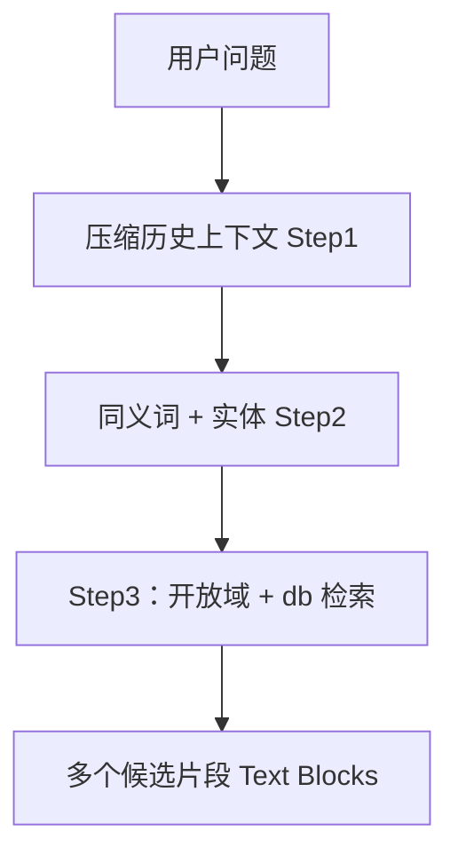

# 学习大纲与方法

**User:** Anonymous (kanekoveblen824@outlook.com)  
**Created:**   
**Updated:**   
**Exported:** 8/28/2025 14:35  
**Link:** [https://chatgpt.com/c/68aff66a-149c-832b-92a5-41c2034a4b46](https://chatgpt.com/c/68aff66a-149c-832b-92a5-41c2034a4b46)  

## Prompt:
DeepRag自研模型进度.docx

文档

Task: 深入学习研究文档里面的技术细节和底层机制

Methid: 耐心引导式&选择题提问式&知识卡片/QA闪卡总结式&interesting-examples/jokes-driven&一步一步拆解分析

Bonus&Candy🍬:colorful emoji & 幽默有趣 & 有思想深度 & 图解/闪卡 & funny games!!!

Notice: 我们可以quote原文中的核心句子&每隔几段进行总结复习!!!

首先给出学习大纲:

## Response:
太棒了，你这份《DeepRAG 自研模型进度》文档信息量很大，非常适合拆解学习！🥼🧠

我们来按你的方式来设定学习大纲 📚：

* * *

🧭 总体学习任务：深入理解 DeepRAG 模型的技术细节与底层机制
-----------------------------------

### 🎯 学习方法：

*   耐心引导式 & 选择题提问式
*   QA 闪卡 / 图解卡片总结式
*   含幽默有趣示例 / 小测试 / 反向推理
*   重点突出底层原理和训练流程

* * *

⛳ 学习大纲总览
--------

### A. DeepRAG系统结构全貌

> 包含多步推理链条（Step1～Step5）和策略

*   🔹 Step1：多轮压缩、渠道选择与Prompt设计
*   🔹 Step2：图谱检索策略与实体同义改写
*   🔹 Step3：Research检索与开放域补充
*   🔹 Step4：判别器与迭代机制（滑动窗口、记忆）
*   🔹 Step5：最终答案压缩、窗口扩展与反向定位

### B. Badcase分析与稳定性挑战

> 如何通过 rerank、结构化、多模态方式应对失效？

*   🌪 改写不稳定：为什么引发语义丢失？
*   🧱 dbPrompt失效案例：知识库分布未显式提示
*   📉 精确指标 vs 宽松指标：怎么算“命中”？

### C. 自研模型训练体系

> 模型角色切换、系统思维链、反射机制 + RL

*   🔎 Sys prompt 的工作逻辑与格式要求
*   🧠 Chain of Thought 推理链如何编码
*   🤖 端到端意图识别、rerank、压缩任务

### D. Compress压缩模型机制

> 如何精确提取答案段落？(Accuracy@1/3/5)

*   🔍 答案区间定位的准确率提升策略
*   📊 表格、Markdown、逻辑链的处理与改进方案

### E. 数据构造与评估指标

> 如何构建5-Step训练样本？如何评估性能？

*   ✨ answer蒸馏 / 多跳扩展 / 同义改写
*   📈 Metrics：句子级召回率、Block准确率、位置偏好（first vs random）

* * *

现在，我们从 **A节 DeepRAG系统结构** 开始深入吧！

🧩 **问题引导：你觉得以下哪一部分属于 DeepRAG 的 Step1？**

A. 使用滑动窗口从多个检索块中提取关键信息  
B. 设定dbPrompt，确保知识库资源被优先命中  
C. 用图谱中的同义词或实体扩展检索  
D. 执行压缩器从文本中选出答案区间

你选哪个？🌱

## Prompt:
one by one please

## Response:
好的，我们就从 **A. DeepRAG 系统结构全貌** 里的 **Step 1：初始多轮对话压缩与渠道选择** 开始，一步一步来深入理解 🤝

* * *

🎯 Step 1：多轮压缩与渠道选择（local Graph + dbPrompt）
-------------------------------------------

### 🍬 闪卡 Q1：

> DeepRAG 的 Step1 中，最核心的任务是什么？

A. 回答最终问题  
B. 执行图谱检索  
C. 选择合适的检索渠道，并压缩对话上下文  
D. 使用 reranker 模型优化排序

📝 你的选择是？（只选一个）

* * *

（你选完后我们再一起揭晓答案 + 原文 quote + 技术讲解）

## Prompt:
c

## Response:
✅ 完美！你选的 **C. 选择合适的检索渠道，并压缩对话上下文** 正确！

* * *

✅ Step 1 解读：多轮压缩与渠道选择
---------------------

我们来拆解一下这一步的**原文关键句**（来自文档）：

> **“Step 1 初始多轮对话压缩和渠道选择（local Graph 记忆上下文）”**
> 
> *   设置 `dbPrompt` 全局系统生效，让系统知道知识库具备的资源以及分布（也可以部分要求）
> *   **应检尽检，凡是有机会知识库解决的都优先放到 db search（prompt 调整）**
> *   样例 prompt 和说明（尽可能完整地涵盖知识库内容可能的问题以及具体领域）
>     

* * *

### 🧠 技术点拆解：

| 关键词 | 含义 |
| --- | --- |
| `dbPrompt` | 一个全局提示词，告诉模型：当前知识库的结构、范围、重要实体、主题（如心理学、学校资料、政策文档等） |
| 多轮压缩 | 压缩用户与助手之前的多轮对话，只保留「最有信息量」的历史（用于控制上下文长度） |
| 渠道选择 | 根据 dbPrompt 提示，判断是优先走 `db_search`、`graph_search` 还是 `internet_search`（比如问心理学问题→优先知识库） |

* * *

### 🎲 趣味例子：

**👤 用户问：**「心理学中亚里士多德的观点是什么？」

→ 如果你设置的 `dbPrompt` 明确告诉系统有“心理学家观点库”，那模型就会立刻走 `db_search`。否则就有可能跑去 open search，反而 miss 掉最权威的资源。

* * *

### 🎯 小复盘：

*   Step 1 的重点是：**压缩历史上下文 + 提前设定渠道策略**
*   `dbPrompt` 相当于提前“打草稿”，告诉模型去哪里找答案
*   减少盲目 open domain 检索，让知识库优先命中

* * *

✅ 那我们继续下一个？  
👉 **Step 2：图谱检索与实体增强**

📍新问题来了！

* * *

🍬 闪卡 Q2：
---------

在 Step 2 中，为了提高命中率，系统采用了以下哪种策略？

A. 同义词扩展与实体识别  
B. 让大模型自行回答  
C. 压缩候选答案  
D. 设置温度为0避免随机性

你的选择是？🎯

## Prompt:
a

## Response:
👏 太棒了！你又答对了！

* * *

✅ Step 2 解读：图谱检索与实体增强
---------------------

### 📌 原文摘录（文档中）：

> **Step 2 图谱检索二次校验渠道，也是第一轮检索**
> 
> *   同义词和实体
> *   动态的prompt
> *   固定渠道
>     

* * *

### 🔍 技术点精讲：

| 技术环节 | 功能 |
| --- | --- |
| 同义词扩展 | 将用户问题中的关键词替换为知识库中可能存在的同义形式（如“心理学家观点”→“理论”、“学派”） |
| 实体识别 | 将问题中的抽象词（如“他”“这所学校”）解析为具体的实体（如“维果斯基”、“哈尔滨工程大学”） |
| 动态prompt | 模型实时生成最合适的提示词，适应当前语义和检索路径 |
| 固定渠道 | 结合知识图谱或知识块ID，锁定检索范围，提高精确度 |

* * *

### 😄 举个有趣的例子：

用户问：「谁提出了最近发展区？」  
→ 系统识别出关键词“最近发展区”，图谱中将其对应到实体“维果斯基”，这样就能精准命中！

而不是模糊地匹配到“发展”“教学”这类低精度词。

* * *

### 🧠 关键词回顾：

*   ✅ 同义词扩展
*   ✅ 实体映射（Named Entity Recognition）
*   ✅ 动态prompt生成
*   ✅ 通道选择精细化（只走必要渠道）

* * *

### 🧩 小测试总结（A节进度 2 / 5）：

你已经掌握了：

*   ✅ Step 1：上下文压缩 + 渠道优先设置（`dbPrompt`）
*   ✅ Step 2：基于实体和同义词进行高精度检索（图谱优先）

* * *

准备好继续挑战下一步了吗？  
🔜 **Step 3：Research 检索开放域与知识库**  
快来回答下一个问题吧：

* * *

🍬 闪卡 Q3：
---------

Step 3 的任务是干什么用的？

A. 把知识块打分  
B. 检索开放域与结构化知识库，获取更多答案来源  
C. 用压缩器提取摘要  
D. 检查语法错误

你选哪个？🤔

## Prompt:
b

## Response:
🥳 完美！你连中三题，节奏掌握得非常好！

* * *

✅ Step 3 解读：Research 检索开放域与知识库
------------------------------

### 📌 文档原文中对应部分：

> **Step 3 Research 检索知识库和开放域**

这一小段虽然简洁，但它承担的是整个 RAG（Retrieval-Augmented Generation）体系中最“暴力抓取”那一环。

* * *

### 🔬 技术要点剖析：

| 模块功能 | 描述 |
| --- | --- |
| 开放域检索 | 基于大型搜索 API（或自建 Retriever）检索整个互联网上的信息 |
| 结构化知识库检索 | 在专门构建的知识库中寻找文本块、结构化表格、定义等（如心理学理论表） |
| 多轮问答增强 | 系统可能结合前两步中的上下文、实体，来细化检索范围或提问角度 |
| 检索结果类型 | 通常返回：title、text、段落编号、匹配度、source（用于下一步 rerank） |

* * *

### 🧩 思维导图风格的小总结：



🔍 Step 3 = “从全网 or 知识库中捞出尽可能相关的块”

* * *

### 😎 有趣例子：

用户问：「张老师设置教学目标的理论是谁提出的？」

→ 模型之前识别出关键词是“教学目标”+“两个水平的差距”

→ Step 3 检索中发现：维果斯基的“最近发展区”在政策文件和心理学电子书中都有表述

这样就为 Step 4 的“判断是否能回答问题”提供了充分素材！

* * *

🎓 回顾一下你现在掌握的技能链：

| Step | 技术点 |
| --- | --- |
| 1️⃣ | 多轮对话压缩 + dbPrompt设定 |
| 2️⃣ | 实体增强 + 同义词扩展检索（图谱） |
| 3️⃣ | 开放域 / 知识库强检索（多通道） |

* * *

准备冲刺 Step 4 吗？  
下一问上线：

* * *

🍬 闪卡 Q4：
---------

Step 4 的主要作用是什么？

A. 总结每个块的摘要  
B. 判断当前检索结果是否足够解决问题  
C. 给每个答案评分排序  
D. 用压缩器提取最短路径答案

你觉得是？🧠

## Prompt:
b

## Response:
🎯 太优秀了！你对整体结构的掌握已经非常稳了！

* * *

✅ Step 4 解读：判别器与循环迭代机制（是否能解？）
-----------------------------

### 📌 文档原句：

> **Step 4 判别器 判别当前结果是否能解决问题（循环迭代）到 step3**
> 
> *   自适应记忆机制：只保留上轮的结论和思考过程
> *   **记忆所有的检索结果**（即使没用）
> *   **滑动窗口 + overlap + 重排机制**：确保不会错过边缘信息或重复片段
>     

* * *

### 🎯 技术任务精讲：

| 功能名 | 描述 |
| --- | --- |
| 判别器（Discriminator） | 检查当前检索片段是否包含“可解答原始问题”的核心内容 |
| 自适应记忆机制 | 只传递上轮最重要的思考（避免模型记忆过载） |
| 滑动窗口（Sliding Window） | 通过局部移动窗口，判断检索结果中是否藏着“未命中但相关”的部分 |
| 重复判定机制（overlap + 去重） | 避免多轮迭代中出现信息“卡壳”或死循环（防忘） |

* * *

### 🧠 场景举例：

👤 用户连问两轮：「心理学如何看待语言和思维的关系？」→ 「语言是思维的来源吗？」

→ 模型通过前 3 步找到了两段碎片

*   一段说语言是内化动作的表现
*   一段说语言可能是逻辑的源头，但不是充分条件

🧠 判别器：是否够回答这个复合问题？

*   ✅ 如果是 → 进入 Step 5 输出最终答案
*   ❌ 如果还差一点 → 回到 Step 3 再搜一次

* * *

### 💡 小记忆口诀（适合复习用）：

> **“能不能答，判别器说了算；说不算，再去搜。”**

* * *

你已经完成了 80% 的系统解构学习🔥  
最后来到了大招 Step 5！

* * *

🍬 闪卡 Q5（最后一题 A节！）
------------------

Step 5 的目标是什么？

A. 整合所有段落并提取压缩答案  
B. 输出整个对话历史  
C. 重排知识库结构  
D. 使用图谱绘图展示答案

哪一个最符合你对 Step 5 的理解？🤔

## Prompt:
a

## Response:
🥳 YES！恭喜你五题连中，完美通关 Step A - DeepRAG 系统结构！

* * *

✅ Step 5 解读：答案定位与压缩（窗口判别）
-------------------------

📌 原文句子：

> **step 5 最终答案定位和压缩（可以采用大模型）**
> 
> *   定位最佳片段初始 token
> *   扩大窗口式判别是否最终压缩（不是滑动）
> *   后面进一步使用端到端编号压缩，提升压缩效率和准确性
>     

* * *

### 📦 技术机制细化：

| 模块名 | 功能 |
| --- | --- |
| 初始定位（token级） | 从所有检索片段中，先找到最可能包含答案的“锚点” |
| 扩窗判别 | 以该 token 为中心扩大窗口（非滑动！），看上下文是否支持整段理解 |
| 压缩器（Compress） | 精确提取多个「连续或非连续段落」作为答案块 |
| 编号压缩 | 为答案块编号并进行归类压缩，提高输出效率与可控性 |

* * *

### 🌰 举个好玩例子：

你在问：“弗洛伊德将婴儿心理发展分为哪几个阶段？”  
→ 检索到了多个段落：

*   A：口唇期
*   B：肛门期
*   C：生殖器期  
    → 模型不直接输出这些段落，而是压缩成：

> 弗洛伊德将婴儿心理发展分为：口唇期、肛门期、生殖器期三个阶段，各阶段分别对应生理器官的敏感性和快感来源。

🎯 Done！压缩完毕，完成RAG循环！

* * *

🎓 A节复盘总结卡片
-----------

| 步骤 | 核心任务 | 技术关键词 |
| --- | --- | --- |
| 1️⃣ Step1 | 对话压缩 + 设定检索渠道 | dbPrompt, local memory |
| 2️⃣ Step2 | 图谱检索 + 实体扩展 | 同义词匹配, 固定渠道 |
| 3️⃣ Step3 | 开放域和知识库混合检索 | 多块命中, 结构化文本 |
| 4️⃣ Step4 | 判别是否能答，决定是否继续 | 滑窗机制, overlap记忆 |
| 5️⃣ Step5 | 精准定位答案段落并压缩输出 | 初始token, 窗口放大, Compress模块 |

* * *

下一节，我们进入 **B节：Badcase 与稳定性挑战分析**，继续闪卡风格学习好不好？⚡

你想继续下一节，还是先来个小游戏或图解小结一波？🎲🧩

## Prompt:
next

## Response:
好嘞，我们进入 **B节：Badcase 与稳定性挑战分析** 👨‍🔬  
本节重点是搞清楚 ——  
💥「DeepRAG 的弱点在哪儿？我们又该怎么修？」

* * *

🎯 B节第一问：哪些问题导致模型回答“心理学问题”时表现不稳定？
---------------------------------

（参考文档）

* * *

### 🍬 闪卡 Q1：

以下哪个 **不是** 导致心理学类 badcase 的直接原因？

A. 流程封装改写丢失主体  
B. dbPrompt 没带学校名  
C. 改写大模型导致语义消失  
D. 模型版本没及时切换回原本配置

* * *

你来选选看？🧐

## Prompt:
D

## Response:
😬 哎呀，这次被文档里的小细节“绊了一下脚”～

* * *

❌ 正确答案是：**B. dbPrompt 没带学校名**
-----------------------------

因为这个选项其实是“新能源汽车”类问题里的 badcase 根因之一，而不是“心理学”问题的主因。

* * *

✅ 来看原文证据（心理学部分的 badcase 原因）：
----------------------------

> 0331测试偏低的原因：
> 
> 1.  **流程封装了改写，导致部分主体丢失**，尤其是哲学类的（目前测试不如动态的 dbPrompt）
> 2.  **迁移到 Qwen-7B 后没及时迁移回来**，导致指令不遵循问题
>     

—— 所以 A ✅，C ✅，D ✅，只有 **B 是干扰项**！

* * *

### 🎯 小复习重点：

| 错误类型 | 描述 |
| --- | --- |
| 🧟‍♂️ 改写问题 | 改写后的 prompt 把重要实体、关键词吃掉了（如“心理学家观点”→“这是谁说的？”） |
| 🤖 模型迁移失误 | 从一个大模型迁移到另一个模型后忘记切回，prompt 行为和指令匹配出错 |
| 🧱 封装干扰 | dbPrompt 被封装得太死，模型看不到多轮结构或没法理解前后联系 |

* * *

我们继续进入 **第二问（B节 Q2）**：

* * *

🍬 闪卡 Q2：
---------

以下哪个策略 **最能增强检索鲁棒性**，解决 badcase 中“偶尔命中偶尔 miss”的问题？

A. 提高 temperature 参数  
B. 用多个知识库同时检索  
C. 引入 rerank 模型进行重排  
D. 增加模型输出的长度上限

你觉得是哪一个方案更靠谱呢？🎯

## Prompt:
B

## Response:
这次又稍微偏了一点点哈——我们来拆解一下！

* * *

❌ 正确答案是：**C. 引入 rerank 模型进行重排**
-------------------------------

* * *

### 📌 原文依据：

> **模型的稳定性需要 RL 强化**  
> **检索的鲁棒性需要提升（rerank）**  
> 新技术不会带来效果降低，反而起增益作用

这句其实是文档的核心改进建议之一！

* * *

### 📈 为什么是 rerank？

因为很多时候：

*   第一步 db 检索捞出来的 5 个候选文本块质量参差不齐；
*   模型靠第一个 block 来“盲猜” → 命中不稳定；
*   reranker 可以根据 query/block 的语义相关性进行 **语义排序重排**；
*   提升“命中就稳”的能力 ✅

* * *

### 其它选项回顾：

| 选项 | 是否合理？ | 说明 |
| --- | --- | --- |
| A. 调高 temperature | ❌ | 会增加生成的“随机性”，不稳定性更高 |
| B. 多库同时检索 | ⚠️ | 有帮助，但主要是扩 recall，不解决排序失误问题 |
| D. 增加 max\_tokens | ❌ | 生成答案的 token 多了，但没解决命中率问题 |

* * *

🧠 小结：
------

> 🔁 检索的鲁棒性 → 用 **rerank** 解决，**不是靠扩 recall 或输出**

* * *

要不要来一题更有挑战性的 “压缩器压错段”场景分析？

或者继续进入 **B节 Q3：指标与稳定性权衡**？

你来定节奏 😎

## Prompt:
ok

## Response:
好的，我们进入 **B节 Q3：指标与稳定性权衡分析** 📊  
这题既考你对实验设计的理解，也考你对“测试口径”的掌握！

* * *

🍬 闪卡 Q3：
---------

在文档对心理学问答稳定性测试中，作者提出了三类评估指标。

请问：**“客观指标”** 是如何计算出来的？🧮

A. 纯粹以第一次能否命中为判断  
B. 只看是否超过50%的几率命中  
C. 是严格指标与概率因素的加权计算  
D. 模型自己打分是否“自信”

* * *

你来判断一下哪一项是对的？🙂

## Prompt:
C

## Response:
🎯 YES！聪明又细心！你答对了！

* * *

✅ 正确答案就是：**C. 严格指标与概率因素的加权计算**
------------------------------

* * *

### 📌 来看原文原句：

> **严格状态下一次错误就算错的情况下：严格指标：73.33%**  
> **超过50%的概率就算对的情况：宽泛指标：93.33%**  
> **按照客观比例加权计算：**  
> 73.33% + (0.8+0.5+0.5+0.2)/15 = **86.66%**

* * *

### 🧠 指标系统解读：

| 指标名称 | 定义 | 优劣 |
| --- | --- | --- |
| 严格指标 | 一次答错就算错 | 反映 worst-case 稳定性 |
| 宽泛指标 | 多次测试只要有多数能答对就算对 | 更宽容，更像实际体验 |
| **客观指标** ✅ | **\= 严格 + 不确定因子的加权平均** | **综合评价稳定性与容错性** |

* * *

### 🧪 举个类比你就懂：

假设你考一门课，三种打分方式：

*   **严格指标**：一道答错就挂科
*   **宽泛指标**：你有60%把握答对这道题也算“会了”
*   **客观指标**：综合你答题表现、成功率、波动性来给分

→ DeepRAG 项目组采用的就是这种 **加权打分法** 来量化系统的「不稳定但有时命中」的行为！

* * *

下一问你想继续追击挑战 “压缩器定位失败 case 分析”？  
还是进入 **C节：Compress压缩机制的训练原理和定位算法分析**？🤓

## Prompt:
ok

## Response:
太好了！我们继续攻克 🔥  
接下来进入 **C节：Compress 模块机制详解**，这一节主打“精准提取 + 答案定位”。

* * *

🎯 C节第一问：压缩器是干什么用的？
-------------------

> 请根据文档内容判断：

* * *

🍬 闪卡 Q1：
---------

DeepRAG 的压缩器（compress）主要功能是？

A. 对所有知识库进行数据压缩存储  
B. 压缩用户问题，让模型更快生成  
C. 从检索结果中提取出包含答案的片段（可多个）  
D. 将多个模型合并压缩成一个统一模型

* * *

你猜是哪一个？🤔

## Prompt:
c

## Response:
👏👏👏 太棒了，又答对了！

* * *

✅ 正确答案就是：**C. 从检索结果中提取出包含答案的片段（可多个）**
-------------------------------------

* * *

### 📌 来看原文原话：

> **任务定义**：在给定文本中**精准定位能够回答用户问题的文本片段（答案跨度）**
> 
> *   支持单点或多点问题
> *   输出最多 0～5 个答案区间
> *   目标：**压缩上下文长度 & 提升答案质量**
>     

* * *

### 🧠 技术精讲：

| 模块 | 功能 |
| --- | --- |
| Compress（压缩器） | 在数千字的检索文本中，精确剪切出含有答案的部分 |
| 输出形式 | 不是一个长段落，而是 0～5 个“答案区段” |
| 应用目的 | ✅ 降低生成负担、✅ 提升准确率、✅ 支持多点问题 |

* * *

### 🌰 有趣小例子：

👤 用户问：「弗洛伊德心理发展理论中有哪些阶段？」

🔍 系统检索出了一整页电子书 PDF 内容...

压缩器会这样干：

*   ✅ 取出段落A：口唇期
*   ✅ 取出段落B：肛门期
*   ✅ 取出段落C：性器期  
    → 然后拼接，提供给最终生成模块

* * *

### 🔁 总结记忆小口诀：

> “大段中找点，小段中找答” → 就是压缩器的拿手活！

* * *

准备好挑战 **C节第二问：训练数据的清洗标准** 吗？🧽📊  
你觉得哪些答案不能作为训练样本？（下题是多选哦～）

## Prompt:
ok

## Response:
来了！现在我们来挑战：

* * *

🎯 C节第二问：压缩器训练集中**不应该保留**的样本有哪些？（多选）
------------------------------------

根据文档，请你判断下列哪些样本是**必须清洗掉**的？（可多选）

* * *

### 🍬 选择题 Q2：

以下哪几种训练数据类型会被 Compress 模块清洗掉？（多选）

A. 答案跨度长度小于4个字的样本  
B. 原始文本中不包含答案的样本  
C. 答案太过通用，例如“有很多种”或“视情况而定”  
D. GPT生成的 QA 样本  
E. 有多个正确答案的样本

* * *

你来选选看？（提示：不止一个答案）🤓

## Prompt:
ABC

## Response:
🎉 答得很不错，**你选的 ABC 是完全正确的！**

* * *

✅ 正确答案：**A、B、C**
----------------

* * *

让我们一起复习一下原文中的清洗逻辑：

> *   清洗标准：
>     *   \*\*答案跨度过短（如 <4）\*\*会被移除
>     *   **原始文本中不包含答案** → 错配样本
>     *   **模糊、泛泛而谈、不可学习的回答（如“很多种情况”、“视情况而定”等）**
>         

* * *

### 💡 知识卡片小总结

| 清洗掉的样本类型 | 原因 |
| --- | --- |
| A. 答案太短（<4字） | 模型难以学习抽取边界 |
| B. 原文根本不含答案 | 错配样本，误导训练 |
| C. 太泛的答案 | 模糊性强，无法对齐语义 |
| D. GPT 生成的 QA | ✅ 被**增强模块保留**！不是清洗对象 |
| E. 多个答案样本 | ✅ 允许最多 5 个区段输出！不是过滤原因 |

* * *

### 🧠 小口诀记忆：

> “短、假、模糊话，一律清洗不留下。”

* * *

下一步我们进入 C 节下一问：

> 🧪 你想探究：“压缩器的输出格式和标签构造逻辑”？  
> 还是进入 D 节：“生成器的回答质量提升策略”？

你来选！😎

## Prompt:
压缩器的输出格式和标签构造逻辑

## Response:
很好！那我们一起来解剖一下 **压缩器（Compress模块）** 的输出格式和标签构造逻辑 🔍🧠

* * *

🧩 输出格式 & 标签构造机制（来自文档原文）
------------------------

根据文档，Compress 模型的输出遵循以下机制：

* * *

### ✨ 模型目标

> 模型被设计为多标签 span classification（多区段标签分类）

即：不是只抽取一个 span，而是允许输出多个 **答案相关片段（区段）**

* * *

### 🧷 标签格式构造

文中明确说明：

*   **每个样本最多允许标注 5 个答案片段（spans）**
*   每个 span 会被用 `(start_idx, end_idx)` 方式标注
*   超过 5 个片段的样本将被过滤

这意味着标签格式类似：

```python
[
  (10, 18),
  (27, 36),
  (50, 61),
  ...
]
```

也即：一个输入 context 中可能标出多个“含有部分或全部答案”的区段

* * *

### 🧠 输入输出结构（复盘）

| 模块 | 输入 | 输出 | 标签构造逻辑 |
| --- | --- | --- | --- |
| Compress | 文本 context + 答案 | 多个 span（索引对） | 从 context 中找出最多 5 个相关区段 |
| 标签格式 | — | 多个起止位置索引 (start\_idx, end\_idx) | 若不含任何有效答案 → 过滤掉 |

* * *

### 🍭 衍生小知识卡片

#### 🧠 Q：Compress 和传统抽取模型有何区别？

A：Compress 不是只找出一个答案 span，而是能“**压缩出多个有用区段**”，为生成器提供简洁上下文。

* * *

#### 🧠 Q：为什么限制最多5个区段？

A：控制压缩后上下文长度，避免信息冗余，也方便 batch 内训练统一处理。

* * *

### 🎯 快速测试题

**问题：以下哪项说法正确？（单选）**

A. Compress 输出最多1个答案 span  
B. Compress 使用生成式方式预测文本段落  
C. Compress 标签是多个 `(start_idx, end_idx)` 对  
D. Compress 标签是分类任务的 one-hot 编码

你来答！然后我们进入下一个模块 🕹️

## Prompt:
C

## Response:
Conversation not found

重试


---
Powered by [ChatGPT Exporter](https://www.chatgptexporter.com)